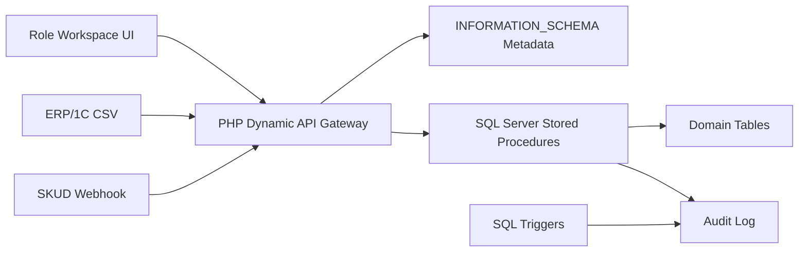

# System Architecture

AIS Attendance Platform is designed as an on-premise university attendance product for environments where SQL Server, Windows-friendly deployment, controlled integrations, and auditability are more important than cloud-native complexity.

The architecture is intentionally conservative: SQL Server owns the business rules, PHP owns transport and presentation, and external systems interact through narrow integration contracts.

## Architectural Drivers

| Driver | Design Response |
| --- | --- |
| Strict handling of personal data | Keep mutation rules and audit close to the database |
| Legacy Windows/SQL Server environment | Use PHP, Apache, SQL Server, and `sqlsrv` drivers |
| Existing ERP/1C and SKUD systems | Integrate through CSV exchange and signed webhooks |
| Heavy administrative reporting | Push aggregation and filtering into SQL Server |
| Low operational budget | Avoid paid frameworks, cloud services, and new hardware requirements |

## Database-Centered Domain Model

The product uses a thick database architecture. Stored procedures are the primary business API; triggers enforce consistency and audit rules; PHP routes requests into this contract.

The original database scripts under `Database/*.sql` contain:

| Object Type | Count |
| --- | ---: |
| Unique tables | 42 |
| Unique stored procedures | 125 |
| Unique triggers | 17 |
| Unique `CREATE INDEX` definitions | 98 |

The clean publication schema in `Database/schema/` is a safe review skeleton. It contains the core domain shape without personal data or production-specific identifiers.

## Request Flow

## Dynamic API Gateway

The PHP gateway accepts an `action` and parameters. It validates the action name, checks `INFORMATION_SCHEMA.ROUTINES`, reads parameter metadata from `INFORMATION_SCHEMA.PARAMETERS`, builds SQL Server bindings, and executes the procedure with `sqlsrv_prepare`.

This creates a stable product extension model:

- add a stored procedure to add a backend capability;
- keep transport code stable;
- use SQL metadata instead of duplicated PHP endpoint definitions;
- enforce authorization again inside stored procedures.

The UI references 67 unique API actions, all backed by SQL procedure definitions.

## Indexing Strategy

The platform is operational during class time and analytical after class time. Curators and administrators need fast reports for repeated absences, group risk, unresolved excuses, teacher workload, schedule coverage, and audit review.

The index strategy uses:

- composite indexes for group/date/status access paths;
- covering indexes for report grids and dashboards;
- filtered indexes for active workflow queues;
- uniqueness constraints for duplicate prevention;
- full-text support through `ftCatalog` for search-oriented behavior;
- maintenance procedures based on `sys.dm_db_index_physical_stats`.

The purpose is predictable reporting latency, not maximizing object counts.

## Audit and Retention

Audit logs capture operational and security-sensitive actions. The SQL source defines a partition function `pf_LogDate` and partition scheme `ps_LogDate`, which establishes the retention direction for date-based log management.

A production deployment should bind the final audit/log table and indexes to the partition scheme and schedule retention operations according to institutional policy.

## SKUD Integration

SKUD events are accepted through a signed webhook:

- source IP allowlist;
- `X-SKUD-Signature`;
- `X-SKUD-Timestamp`;
- `X-SKUD-Nonce`;
- `HMAC-SHA256` over timestamp, nonce, and raw body;
- nonce cache with replay detection.

A SKUD event is treated as building-access evidence, not automatic classroom attendance. Attendance remains tied to lessons and QR/manual marking policy.

## ERP/1C Integration

ERP/1C exchange is file-based by design. CSV import/export limits coupling and avoids granting direct database access to external systems.

Confirmed behavior includes:

- UTF-8 BOM stripping;
- normalized line endings;
- semicolon-based parsing for import procedures;
- group import;
- student import;
- attendance export;
- import and integration audit logging.

Windows-1251 conversion is a compatibility extension point, not part of the confirmed implementation.

## Runtime Model

The runtime is designed for institutional infrastructure:

- PHP 8.2 with Apache;
- Microsoft SQL Server;
- vanilla JavaScript UI;
- file-backed local runtime folders for sessions, idempotency, and nonce cache;
- Docker Compose for evaluation;
- Windows/XAMPP compatibility for legacy deployment.

The result is a product that prioritizes deployability, auditability, and institutional fit over architectural fashion.
