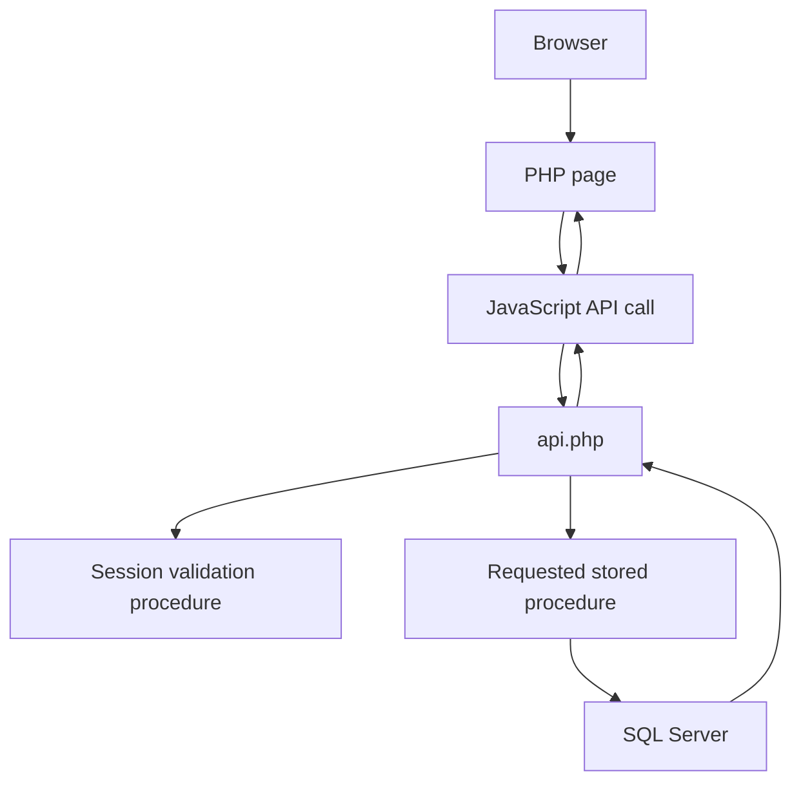
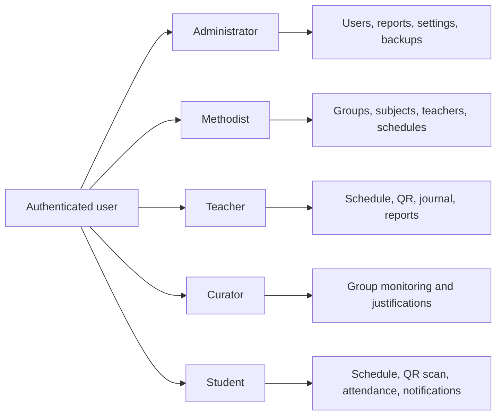
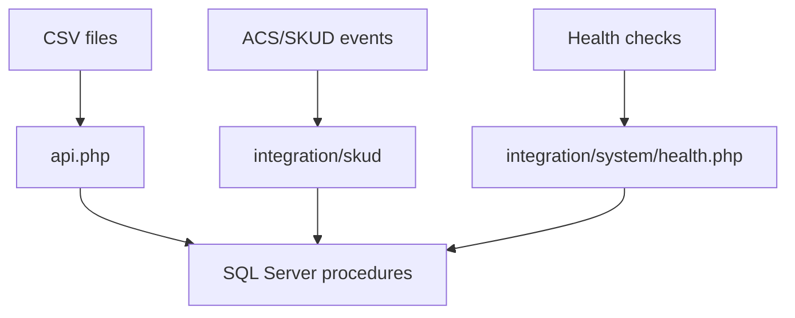

# Diagrams

## Runtime Request Flow

```mermaid
flowchart TD
    A[Browser] --> B[PHP page]
    B --> C[JavaScript API call]
    C --> D[api.php]
    D --> E[Session validation procedure]
    D --> F[Requested stored procedure]
    F --> G[SQL Server]
    G --> D
    D --> C
    C --> B
```

## Role Areas

```mermaid
flowchart LR
    U[Authenticated user] --> A[Administrator]
    U --> M[Methodist]
    U --> T[Teacher]
    U --> C[Curator]
    U --> S[Student]
    A --> A1[Users, reports, settings, backups]
    M --> M1[Groups, subjects, teachers, schedules]
    T --> T1[Schedule, QR, journal, reports]
    C --> C1[Group monitoring and justifications]
    S --> S1[Schedule, QR scan, attendance, notifications]
```

## Integration Surface

```mermaid
flowchart TD
    CSV[CSV files] --> API[api.php]
    ACS[ACS/SKUD events] --> SKUD[integration/skud]
    Health[Health checks] --> H[integration/system/health.php]
    API --> DB[SQL Server procedures]
    SKUD --> DB
    H --> DB
```
