# Диаграммы AIS V2

## D01. Контекст системы

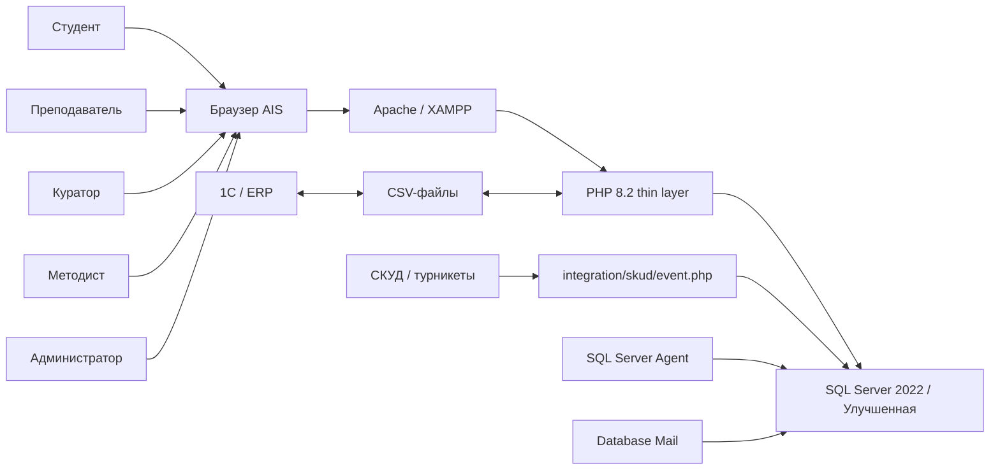

## D02. Архитектура по слоям

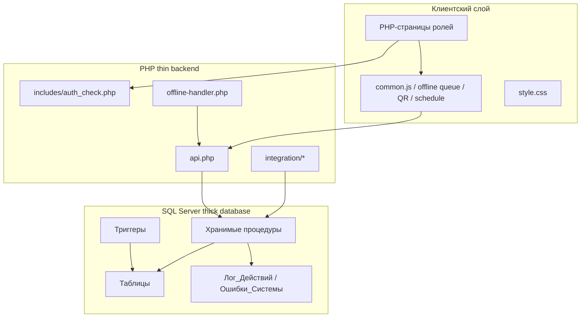

## D03. Общий поток API

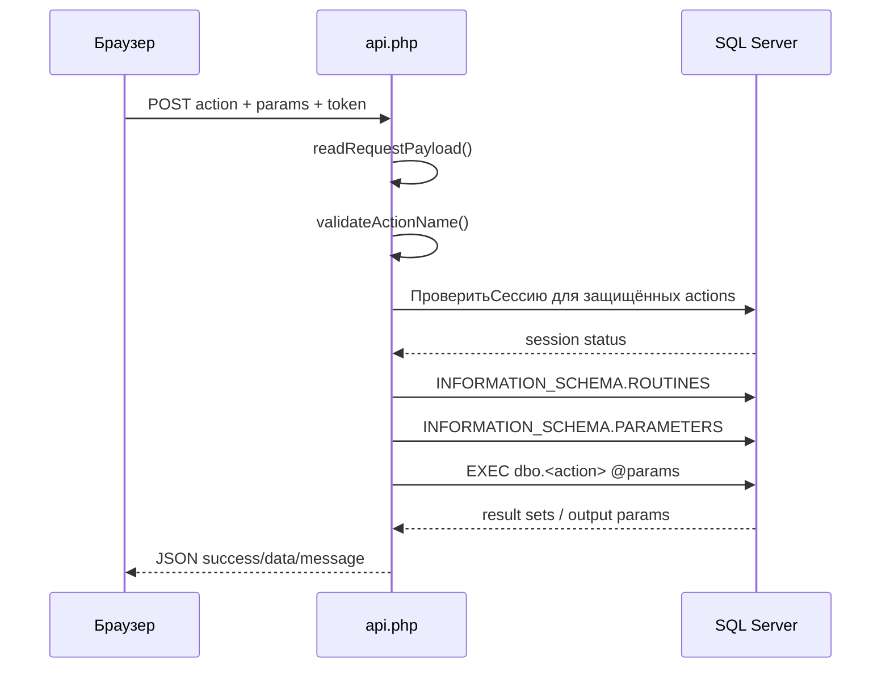

## D04. Авторизация и доступ к странице

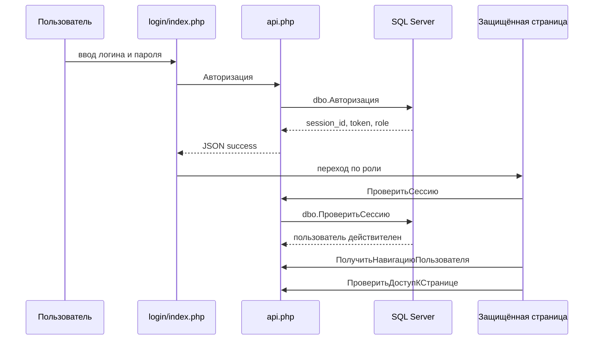

## D05. Роли и навигация

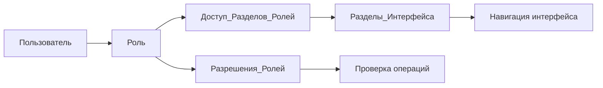

## D06. Ручная посещаемость

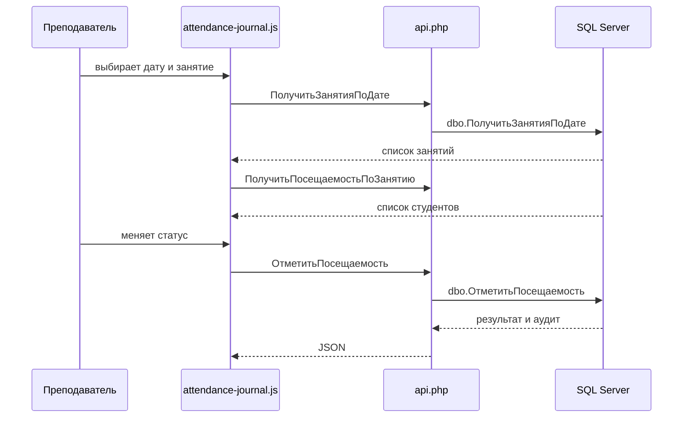

## D07. QR-посещаемость

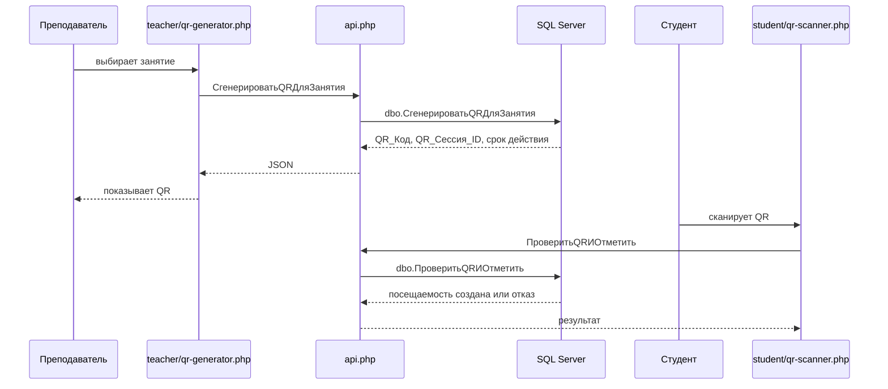

## D08. Offline queue

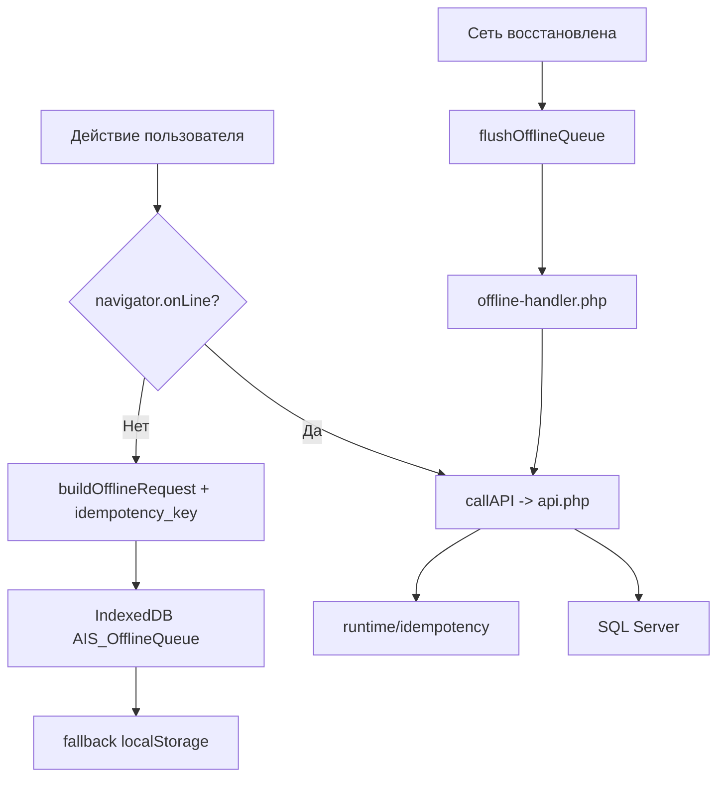

## D09. Обоснование отсутствия

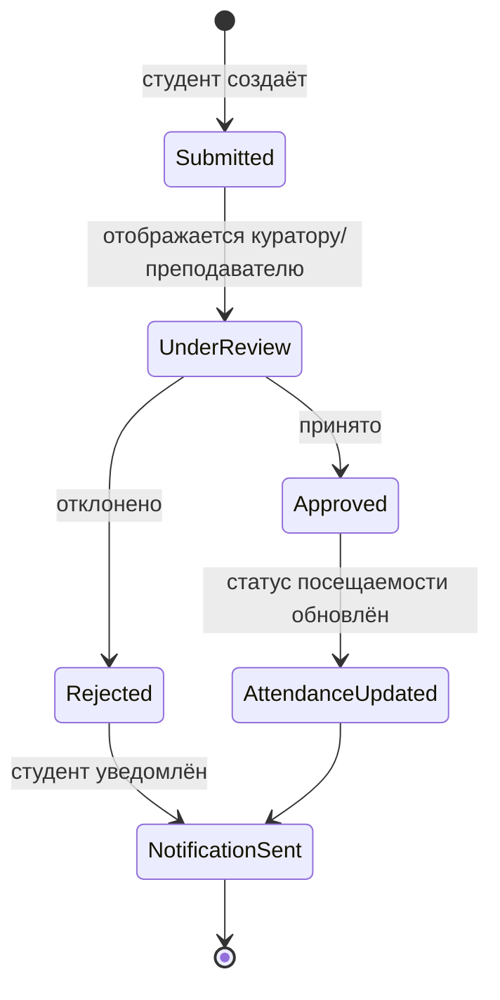

## D10. SKUD webhook

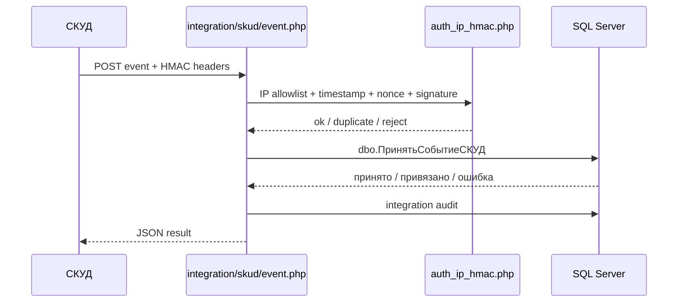

## D11. CSV / 1C exchange

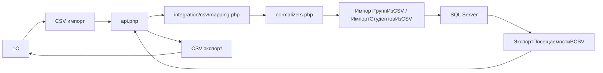

## D12. Защита SKUD-запроса

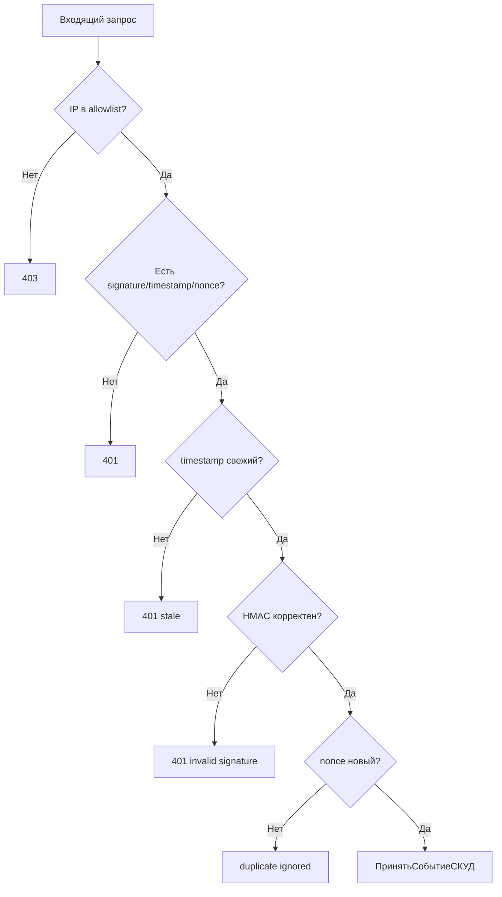

## D13. Администрирование

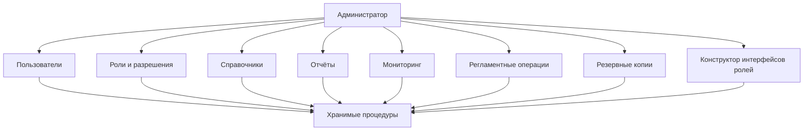

## D14. Плановые отчёты

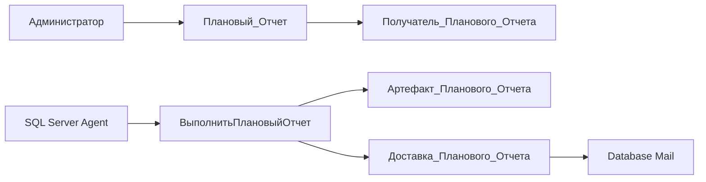

## D15. Расписание

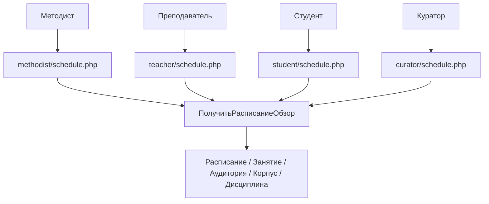

