# Технический отчет по результатам анализа реализации АИС учета посещаемости занятий студентами

Дата анализа: 22.06.2026. Репозиторий: `[APP_ROOT]`.

## 1. Назначение технического отчета

Документ получен методом обратного проектирования фактической реализации. Он предназначен для передачи системы старшему разработчику, архитектору, DBA, администратору и специалисту по информационной безопасности. Описаны только обнаруженные в репозитории компоненты и поведение; проектные намерения без реализации не принимаются за факт.

## 2. Методика анализа кодовой базы

Проведены сплошная инвентаризация дерева, чтение 104 текстовых файлов и идентификация одного бинарного ресурса, синтаксическая проверка всех 69 PHP-файлов командой `${PHP_BINARY:-php} -l`, анализ HTML/JavaScript, конфигурации Apache/PHP, маршрутов, хранимых процедур, триггеров, функций, индексов и межмодульных вызовов. Всего просмотрено 105 файлов в 25 каталогах без учета служебных каталогов зависимостей; автоматизированных тестов не обнаружено.

| Анализируемая область | Просмотренные файлы/каталоги | Выявленные компоненты | Комментарий |
|---|---|---|---|
| Точки входа | `index.php`, `api.php`, `offline-handler.php`, `login/*`, `integration/*` | web UI, SQL RPC-шлюз, повтор offline-запросов, webhook СКУД, health check | Формального роутера нет |
| Backend | корень, `includes/`, каталоги ролей | процедурные PHP-обработчики и страницы | Основная бизнес-логика находится в SQL |
| Frontend | `assets/`, страницы ролей | vanilla JavaScript/CSS, `fetch`, localStorage, IndexedDB | Сборки frontend нет |
| База данных | 10 файлов `Database/*.sql` | 42 таблицы, 125 уникальных процедур, 17 триггеров, 3 функции, 98 уникальных объявлений индексов | 150 объявлений процедур показывают повторные переопределения; представлений нет |
| Конфигурация | `config.php`, `.htaccess`, `README.md` | параметры БД/URL, Apache rules, локальный запуск | `.env`/контейнеризация не обнаружены |
| Безопасность | `api.php`, `includes/auth_check.php`, `login/*`, SQL auth/session procedures | токены БД, PHP-сессия, HMAC СКУД | Выполнен анализ authn/authz, CSRF/XSS/SQLi/IDOR |
| Интеграции и операции | `integration/`, `Database/scheduled_reports_agent.sql`, admin-страницы | файловый CSV, Database Mail, SQL Agent, webhook | Внешняя конфигурация не входит в репозиторий |

## 3. Карта репозитория

| Путь | Назначение | Ключевые файлы | Архитектурное значение | Примечания |
|---|---|---|---|---|
| `/` | общие entry points и конфигурация | `index.php`, `api.php`, `config.php`, `.htaccess`, `offline-handler.php` | транспортный и конфигурационный центр | `api.php` вызывает произвольную существующую процедуру `dbo` |
| `includes/` | общая серверная обвязка | `auth_check.php`, `role_helpers.php`, `header.php`, `footer.php` | проверка сессии, навигация, layout | проверка выполняется через внутренние HTTP-вызовы к собственному API |
| `assets/` | клиентские ресурсы | `js/common.js`, `js/attendance-journal.js`, `css/style.css` | API-клиент, offline-очередь, UI | `style.css` — 7 585 строк с повторными блоками темы |
| `login/` | вход и восстановление | `index.php`, `session_set.php`, `logout.php` | создание локального состояния после SQL-аутентификации | `session_set.php` сам токен не проверяет |
| `admin/` | административный UI | 18 PHP-страниц | пользователи, справочники, отчеты, контрольная плоскость | backend-файлов-контроллеров отдельно нет |
| `methodist/` | UI методиста | 6 PHP-страниц | группы, предметы, преподаватели, расписание | доступ через `requireRole()` |
| `teacher/` | UI преподавателя | 7 PHP-страниц | журнал, QR, отчеты, обоснования | запись посещаемости идет через общий RPC |
| `curator/` | UI куратора | 6 PHP-страниц | студенты, обоснования, отчеты | часть отчетов использует общие процедуры |
| `student/` | UI студента | 8 PHP-страниц | расписание, посещаемость, QR, профиль | QR поддерживает offline-повтор |
| `integration/` | внешние входы и CSV mapping | `skud/event.php`, `system/health.php`, `audit.php`, `csv/mapping.php` | HMAC webhook и health endpoint | прямого API 1С нет |
| `Database/` | схема, миграции и служебный PHP | `Улучшенная.sql`, 9 дополнительных файлов, `apply_trigger_fix.php` | основная доменная логика и эксплуатационные функции | единого механизма версий/порядка миграций нет |
| `runtime/`, `uploads/` | изменяемое состояние | `.gitkeep` | сессии, idempotency, временные данные | очистка idempotency по расписанию не найдена |
| `docs/final-delivery/` | существующие документы | русскоязычные markdown-файлы | справочные артефакты | не использовались как доказательство поведения кода |

## 4. Используемый технологический стек

| Уровень | Технология | Где обнаружено | Назначение | Комментарий |
|---|---|---|---|---|
| frontend | HTML5, CSS, vanilla JavaScript | страницы ролей, `assets/` | UI и запросы | package manager/build pipeline не обнаружены |
| frontend | Fetch API, localStorage, IndexedDB | `assets/js/common.js` | RPC и offline-очередь | токены хранятся на клиенте |
| frontend | локальные QR-скрипты | `assets/js/qrcode.min.js`, `html5-qrcode.min.js` | создание/сканирование QR | сведения о версии/источнике не обнаружены |
| backend | процедурный PHP 8 с `strict_types` | все PHP-файлы | страницы, gateway, интеграции | framework/Composer не обнаружены |
| database access | Microsoft `sqlsrv` PHP extension | `config.php`, `api.php` | prepared RPC к SQL Server | соединение создается на каждый вызов |
| database | Microsoft SQL Server, compatibility level 160 | `Database/Улучшенная.sql` | хранение и бизнес-логика | скрипт рассчитан на SQL Server 2022 |
| web server | Apache/XAMPP, `.htaccess` | `README.md`, `.htaccess` | URL rewriting и защита каталогов | на другом сервере правила не применятся |
| authentication/session | SQL-токены + PHP session | `Авторизация`, `ПроверитьСессию`, `login/*` | аутентификация и UI-контекст | две несинхронные модели состояния |
| reporting | T-SQL, HTML, CSV-like text | report procedures, `scheduled_reports_agent.sql` | интерактивные и плановые отчеты | полноценной Excel/PDF-библиотеки нет |
| import/export | FileReader, JSON/multipart, T-SQL parser | `admin/import-export.php`, `api.php`, SQL imports | CSV-файлы | прямого обмена с 1С не найдено |
| scheduled jobs | SQL Server Agent, Database Mail | `scheduled_reports_agent.sql` | расписание и почтовая доставка | требует внешней настройки и прав `sysadmin` |
| deployment/configuration | PHP env vars, hardcoded defaults | `config.php`, SQL scripts | локальная конфигурация | Docker/CI/CD/.env template не обнаружены |

## 5. Фактическая архитектура системы

Система — монолитное процедурное web-приложение. PHP одновременно обслуживает HTML и выступает универсальным RPC-шлюзом, а большая часть доменной логики реализована хранимыми процедурами и триггерами. Отдельных controller/service/repository/model слоев нет. Страницы содержат шаблон, форму и inline-JavaScript; клиент передает имя процедуры как `action`. Это смешанная процедурная архитектура с признаками «толстой БД».

Вывод по результатам анализа файлов: граница модулей определяется каталогами UI и группами процедур, но не изолирована на backend. Любая аутентифицированная страница использует общий `api.php`, поэтому модульность не создает серверной границы безопасности.

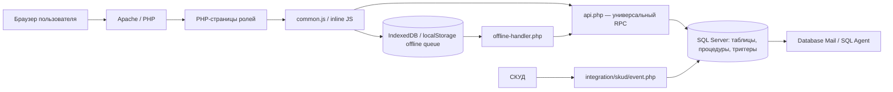

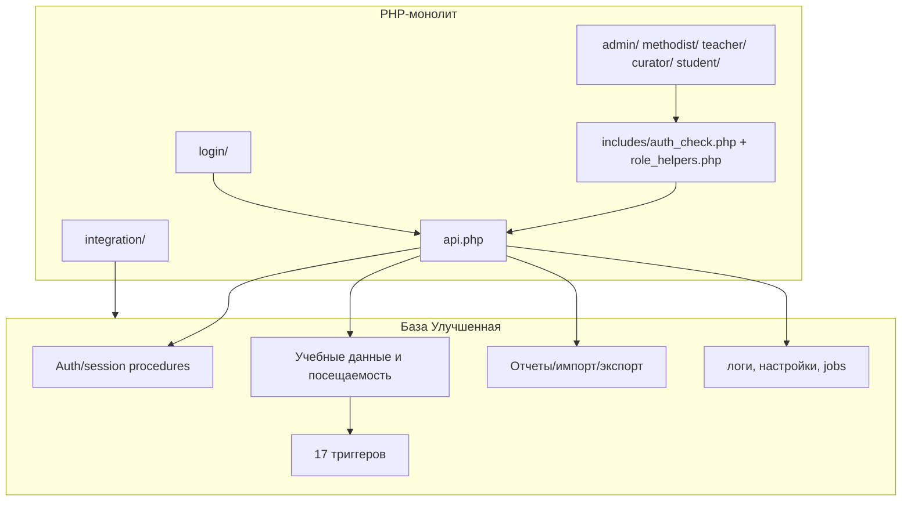

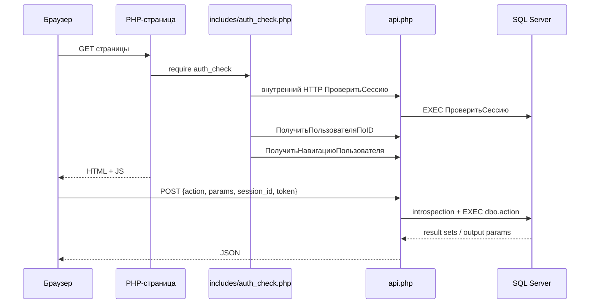

## 6. Точки входа и жизненный цикл запроса

| Entry point | File path | Responsibility | Calls/depends on | Security relevance |
|---|---|---|---|---|
| `/index.php` | `index.php` | проверка сессии и redirect | собственный `api.php`, role routes | внутренний HTTP зависит от `allow_url_fopen` |
| `/api.php` | `api.php` | GET/POST JSON/multipart → procedure | `config.php`, `sqlsrv`, INFORMATION_SCHEMA | authn есть; action-level authz отсутствует |
| `/offline-handler.php` | `offline-handler.php` | пакетный повтор offline-запросов | `api.php` через общий вызов | повторяет токены и actor IDs клиента |
| `/login/` | `login/index.php` | форма входа/reset | auth procedures, `session_set.php` | токен сохраняется в localStorage |
| `/login/session_set.php` | файл | перенос клиентских значений в PHP session | `session_start()` | не валидирует токен, не регенерирует session ID |
| `/login/logout.php` | файл | завершение SQL/PHP-сессии | `ЗавершитьСессию` | CSRF-токен не используется |
| role pages | `admin/*`, `methodist/*`, `teacher/*`, `curator/*`, `student/*` | HTML/UI | `auth_check.php`, inline JS, `api.php` | роль проверяется на уровне страницы |
| SKUD webhook | `integration/skud/event.php` | прием события | HMAC, `ПринятьСобытиеСКУД` | отдельная machine-to-machine защита |
| health | `integration/system/health.php` | проверка БД/системы | `ПроверитьСостояниеСистемы` | secret header; endpoint выключен без секрета |
| trigger fix | `Database/apply_trigger_fix.php` | применение одного SQL-файла | `trigger_notifications_fix.sql` | нет собственной auth; блокируется `.htaccess` только при Apache |

Жизненный цикл: Apache отдает PHP-файл; `auth_check.php` получает токены из PHP session и через HTTP к `API_URL` последовательно вызывает `ПроверитьСессию`, пользователя и навигацию. `requireRole()` принимает буквальное совпадение роли либо grant страницы из БД. После рендера JavaScript читает идентификаторы и токены из localStorage, отправляет `action`. `api.php` проверяет синтаксис имени, наличие процедуры в `dbo`, introspection параметров и для непубличных action — только валидность сессии; затем выполняет prepared RPC через `sqlsrv`. SQL-триггеры могут дополнять запись логами/уведомлениями. Ответ сериализуется как JSON.

## 7. Backend-модули

| Модуль | Файлы | Основные функции/классы | Входные данные | Выходные данные | Используемые таблицы | Зависимости | Риски |
|---|---|---|---|---|---|---|---|
| Аутентификация | `login/*`, `api.php`, `password_reset_database_mail.sql` | `Авторизация`, `ПроверитьСессию`, reset procedures | login/password, token | session, role, reset result | `Пользователь`, `Сессия_Пользователя`, `Восстановление_Пароля` | Database Mail | быстрый SHA-256; rate limit отсутствует |
| Пользователи/роли | `admin/users.php`, `control-plane.php`, `admin_roles_permissions.sql` | CRUD, page grants | user/role/actor IDs | списки/статусы | `Пользователь`, `Роль`, `Разрешения_Ролей`, control-plane tables | generic API | actor ID подменяем клиентом |
| Студенты | admin/methodist/curator/student pages | student CRUD/search/profile | ФИО, группа, contacts | records/JSON | `Студент`, `Учебная_Группа`, `Пользователь` | группы/roles | IDOR, персональные данные |
| Преподаватели | admin/methodist pages | teacher CRUD/list | профиль/учетная запись | records | `Преподаватель`, `Пользователь` | disciplines | IDOR |
| Справочники | admin/reference/groups, methodist pages | faculty/specialty/group/discipline CRUD | form fields | records | `Факультет`, `Специальность`, `Учебная_Группа`, `Дисциплина`, rooms | procedures | неодинаковая server-side валидация |
| Расписание/занятия | schedule pages, `schedule_overview_migration.sql` | create/update/overview, auto-create trigger | даты, группа, дисциплина, week type | расписание/занятия | `Расписание`, `Занятие`, справочники | date functions/triggers | переопределяемые версии и триггеры |
| Посещаемость/QR | teacher journal/QR, student scanner, `attendance-journal.js` | mark, generate/scan/end QR | lesson, student, status, QR | attendance/scan result | `Посещаемость`, `QR_*`, `СКУД_*` | offline queue, triggers | нет проверки ownership; SQL-конфликты статусов |
| Обоснования | student/teacher/curator pages, `Дополнения.sql` | create/list/change status | student, lesson, text/status | list/status | `Обоснования_Отсутствия` | notifications | actor/ownership checks не подтверждены |
| Отчеты | role reports, scheduled reports SQL | group/student/teacher/time/custom reports | filters | result sets, CSV/HTML | attendance core + scheduled tables | Database Mail/Agent | тяжелые агрегации; часть export несовместима |
| Импорт/экспорт | `admin/import-export.php`, `api.php`, CSV mapping, SQL | import groups/students, attendance export | CSV text/file | per-row results/CSV | core, import/export journals | browser FileReader | конфликт сигнатур, слабый CSV parser |
| Уведомления | `notifications.php`, student page, triggers | get/read/create | user/status | records | `Уведомления` | triggers | дефект threshold-trigger |
| Аудит/мониторинг | admin logs/monitoring, `integration/audit.php` | logs, trigger/system stats | filters/events | tables/log file | logs/errors/statistics | filesystem | неполная трассируемость |
| Настройки/операции | admin settings/backup/maintenance | settings, pseudo-backup, maintenance | keys/actor | statuses | settings/backups/logs | SQL | backup не выполняет `BACKUP DATABASE` |

Классы в backend не обнаружены. Контроллеры, сервисы, модели, repositories и middleware как отдельные архитектурные элементы не обнаружены в исходном коде.

## 8. Frontend-структура и UI-логика

| Page/Component | File path | Purpose | Backend interaction | Input forms | Validation | Risks |
|---|---|---|---|---|---|---|
| Общий layout/nav | `includes/header.php`, `footer.php`, `role_helpers.php` | оболочка и меню | navigation/session | нет | server role/page check | статический и DB-grant механизмы расходятся |
| API/offline client | `assets/js/common.js` | fetch, idempotency, queue | все procedures | универсальные params | transport-level | secrets в localStorage/IndexedDB |
| Login/reset | `login/index.php` | вход и reset | public auth actions | login/password/email/token | browser + SQL | нет rate limiting UI/backend |
| Admin users/teachers/students/groups | `admin/users.php`, `teachers.php`, `students.php`, `groups.php` | CRUD | соответствующие procedures | modal forms | в основном required/client checks | server доверяет client actor IDs |
| Control plane | `admin/control-plane.php` | роли, страницы, операции | admin procedures | grants/commands | admin page check | SQL admin-check spoofable |
| Schedule | admin/methodist/role schedule pages | обзор/CRUD | schedule procedures | filters/forms | неодинаковая | риск N+1/self-HTTP не здесь, но много RPC |
| Журнал посещаемости | `teacher/attendance-journal.php`, `assets/js/attendance-journal.js` | отметки | lessons/attendance/mark | status per student | client enum + SQL | offline повтор, нет teacher ownership |
| QR | `teacher/qr-generator.php`, `student/qr-scanner.php` | QR-сессия и скан | QR procedures | scan/code | SQL checks | bearer QR; дефекты constraints |
| Отчеты | `*/reports.php`, `admin/scheduled-reports.php` | filters/tables/export | report/export procedures | dates/entities | client dates | result size и CSV formulas/escaping |
| Import/export | `admin/import-export.php` | чтение/выгрузка файлов | special API handling | file/type | extension/headers частично | файл целиком в памяти, лимита нет |
| Профили | `*/profile.php` | profile/password | get/update user/password | profile/password | client checks | текущий пароль не передается в SQL |
| Уведомления | `notifications.php`, `student/notifications.php` | просмотр/read | notification procedures | filters | минимальная | IDOR при подмене user ID |

Динамические таблицы преимущественно применяют функции экранирования, однако `student/profile.php` передает серверное сообщение в `innerHTML` без гарантированного экранирования. CSP не задана. В `common.js` полная компрометация origin/XSS дает доступ к session/token и offline payload.

## 9. Архитектура базы данных

DBMS — Microsoft SQL Server. Базовый скрипт `Database/Улучшенная.sql` создает БД `Улучшенная`, compatibility level 160, FULL recovery, Query Store, Service Broker и пользователя `php_user` в роли `db_owner`. Физические MDF/LDF пути жестко заданы под MSSQL16. Дополнительные SQL-файлы работают как неверсированные миграции и многократно `ALTER`/переопределяют процедуры.

### 9.1 Таблицы

| Таблица | Назначение | Ключевые поля | Связи | Используется в файлах | Комментарий |
|---|---|---|---|---|---|
| `Роль` | роли | `Роль_ID`, название, уровень | ← `Пользователь` | base/admin role SQL | 7 seed-ролей, включая Гость и Директор |
| `Пользователь` | учетные записи | login, hash, salt, email, active | → роль; ← session/student/teacher/logs | auth, admin, profiles | персональные и auth-данные |
| `Сессия_Пользователя` | bearer-сессии | session ID, token, expiry, active | → user | auth procedures | sliding expiry +2 часа |
| `Восстановление_Пароля` | reset tokens | token hash, expiry, attempts | → user | password reset migration | токен хранится как SHA-256 |
| `Разрешения_Ролей` | feature permissions | role, permission, allow | → role/users | role SQL | core API их не применяет |
| `Разделы_Интерфейса`, `Доступ_Разделов_Ролей` | navigation/page grants | code/path, role/section/allow | → role/section | `admin_control_plane.sql` | защищают страницы, не procedures |
| `Админ_Операции` | журнал control-plane | operation, params, status | → user | control-plane | не общий аудит |
| `Факультет`, `Специальность`, `Учебная_Группа` | учебная иерархия | IDs, names/status | specialty→faculty; group→specialty/curator | core/admin/methodist | группа требует специальность |
| `Студент` | профиль студента | user, ФИО, group, contacts | → user/group | student/admin/import | содержит адрес/телефоны/дату рождения |
| `Преподаватель` | профиль преподавателя | user, ФИО, кафедра | → user | teacher/admin | персональные данные |
| `Корпус`, `Аудитория` | помещения | address; room/capacity | room→building | schedule migration | справочники расписания |
| `Дисциплина` | дисциплины | name/code/teacher | → teacher | schedule/reports | один основной teacher ID |
| `Расписание` | шаблон занятий | group, discipline, weekday/time/week type, room | → group/discipline/room | schedules | `Тип_Недели` добавляется миграцией |
| `Занятие` | факт/экземпляр | schedule, date, status, times | → schedule/creator | attendance/QR/reports | unique schedule+date |
| `Посещаемость` | отметка студента | lesson, student, status, mark type/time | → lesson/student/user | journal/QR/reports | unique lesson+student |
| `QR_Сессия`, `QR_Сканирование` | QR attendance | lesson/code/time/status; session/student/result | → lesson/user/student | QR procedures | enum constraints конфликтуют с кодом |
| `СКУД_Карта`, `СКУД_Устройство`, `СКУД_Событие` | данные проходной | card/student/status; device; event/time/type | карты→student; events→card/device | webhook/QR validation | допускается событие неизвестной карты после migration |
| `Обоснования_Отсутствия` | объяснения пропусков | student/lesson/text/status/reviewer | → student/lesson/user | excuse pages | содержит потенциально чувствительный текст |
| `Уведомления` | сообщения пользователю | user/type/title/text/read/expiry | → user | notification UI/triggers | создаются процедурами/триггерами |
| `Лог_Действий`, `Ошибки_Системы`, `Мониторинг_Триггеров`, `Статистика_Системы` | аудит/диагностика | actor/time/object/details/status | частично → user | admin monitoring, triggers | покрытие неполное |
| `Настройки_Системы` | key/value settings | category/key/value/type | changer→user | settings/auth/reset | не все настройки реально применены |
| `Журнал_Импорта_CSV`, `Журнал_Экспорта_CSV` | metadata обмена | file/type/counts/status | → user | base import/export SQL | поздние процедуры используют не всегда |
| `Система_Интеграция` | metadata integrations | type/address/credentials/status | → configurer | base SQL | работающего 1С клиента нет |
| `Шаблоны_Отчетов` | SQL templates | type/name/query/filters | → creator | report procedures | выполнение возвращает SQL, не исполняет |
| `Резервные_Копии` | metadata backup | file/status/size/actor | → user | backup UI/procedure | физический backup не создается |
| `Временные_Данные` | временный key/value | key/value/expiry | нет | maintenance | отдельна от file idempotency |
| `Плановый_Отчет`, `Получатель_Планового_Отчета`, `Запуск_Планового_Отчета`, `Артефакт_Планового_Отчета`, `Доставка_Планового_Отчета` | scheduled reporting | plan/recipient/run/artifact/delivery | цепочка FK | scheduled report SQL/UI | HTML хранится в БД; mail status не reconciled |

### 9.2 Объекты БД

| Объект БД | Тип | Назначение | Входные параметры | Выход/эффект | Где вызывается | Риски |
|---|---|---|---|---|---|---|
| 125 именованных procedures | procedure | auth, CRUD, reports, integrations, maintenance | introspected dynamically | result sets/OUTPUT/mutations | `api.php`, integrations, jobs | 150 declarations: last-applied version is material |
| `AIS_НомерУчебнойНедели`, `AIS_ТипНеделиДляДаты` | functions | week math | date | number/type | schedule migration | база отсчета зашита в SQL |
| `AIS_HTML_ENCODE` | function | HTML escaping for email | text | encoded text | scheduled reports | используется только в scheduled subsystem |
| 17 `TRG_*` | DML/DDL triggers | auto lessons/status/QR/logs/notifications/guards | `inserted/deleted` | side effects | core tables/database | тяжелые и местами некорректные multi-row operations |
| 98 уникальных index declarations | indexes | поиск, reports, active data | — | access paths | все SQL scripts | перекрывающиеся и избыточные индексы |
| `pf_LogDate`, `ps_LogDate` | partition function/scheme | monthly partitions | datetime | partition mapping | base SQL | привязанный partitioned index/table не обнаружен |
| SQL Agent jobs (3) | jobs | daily/weekly/Friday reports | schedule | calls dispatcher | scheduled SQL | создаются только при доступе/sysadmin |
| Views | — | — | — | — | — | Не обнаружено в исходном коде |

### 9.3 Ключевые связи

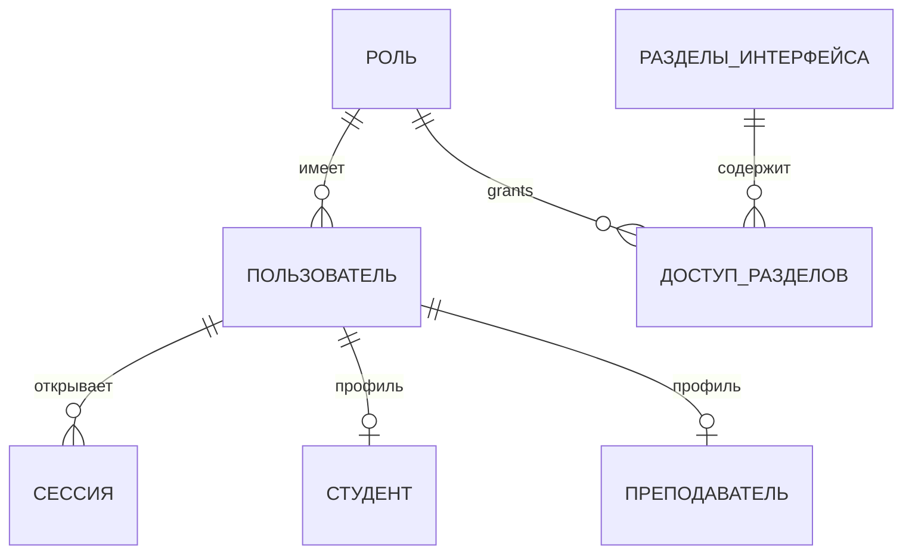

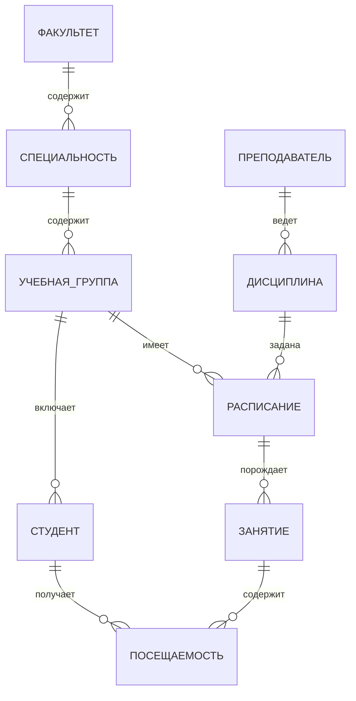

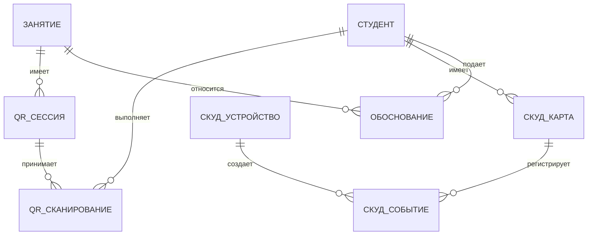

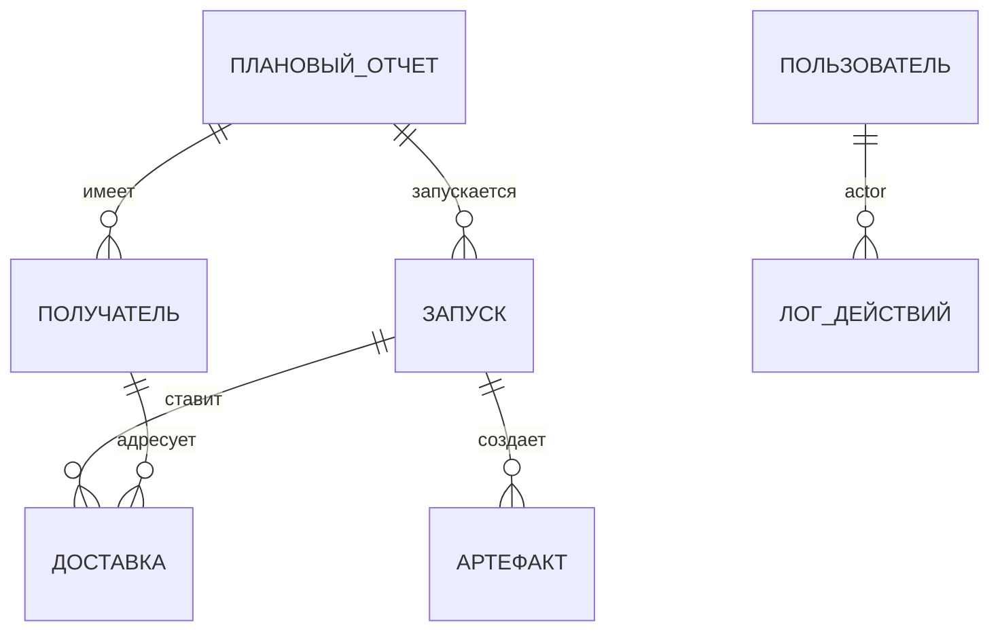

Ссылочная целостность задается FK для основных отношений; уникальные ограничения подтверждены для `Посещаемость(Занятие_ID, Студент_ID)`, `QR_Сканирование(QR_Сессия_ID, Студент_ID)` и `Занятие(Расписание_ID, Дата)`. Набор CHECK-ограничений по статусам не согласован с некоторыми процедурами/триггерами: код записывает `Ожидание`, `В процессе`, `Скоро истекает`, `Вне_здания`, отсутствующие в соответствующих enum constraints.

## 10. Логика работы с данными

| Сущность данных | Где создается | Где изменяется | Где используется | Где экспортируется | Проверки целостности | Риски |
|---|---|---|---|---|---|---|
| Пользователь | admin UI; `СоздатьПользователя`; combined create procedures | profiles/admin/reset | auth, roles, logs | user scheduled report | unique login, FK role, active flag | update/password по client-supplied ID |
| Студент/преподаватель | admin/import procedures | admin/profile procedures | schedule, attendance, reports | attendance CSV/report mail | FK user/group, частичные duplicate checks | PII; неодинаковые validators |
| Расписание | admin/methodist; `СоздатьРасписание` | update procedures | auto lessons, UI, reports | reports | FKs, time/status checks | версия зависит от migration order |
| Занятие | procedure и `TRG_АвтоСозданиеЗанятий` | status/update/triggers | attendance, QR, excuses | reports | unique schedule/date | enum mismatch |
| Посещаемость | manual mark/QR | `ОтметитьПосещаемость` | reports/statistics | attendance CSV | unique lesson/student, CHECK | нет teacher/group check в manual path |
| QR/СКУД | QR procedures; webhook | finish/status triggers | attendance/history | не обнаружено | FK/unique/HMAC | конфликт constraints |
| Обоснование | `СоздатьОбоснование` | `ИзменитьСтатусОбоснования` | role pages | не подтверждено | FK student/lesson/reviewer | ownership не гарантирован |
| Import data | browser → API → SQL | per-row procedures | core/logs | — | checks различаются | plaintext passwords в CSV/error rows |
| Report artifacts | procedures/jobs | delivery states | UI/Database Mail | CSV/HTML mail | unique run key, applock | queued ≠ delivered |
| Logs/settings | procedures/triggers/UI | maintenance/settings | monitoring | не обнаружено | частичные FK | нет before/after audit |

Удаление чаще заменено деактивацией/статусом. `TRG_ЗапретУдаленияКритическихДанных` и `TRG_ЗащитаСтруктурыДанных` ограничивают часть DELETE/DDL. Унифицированного soft-delete, архивирования и retention policy нет. `ОчиститьСтарыеЛоги` существует, но гарантированный scheduler ее запуска не обнаружен.

## 11. Алгоритмы и бизнес-логика

| Алгоритм | Где реализован | Входные данные | Шаги выполнения | Выходные данные | Ошибочные сценарии | Комментарий |
|---|---|---|---|---|---|---|
| Вход | `Авторизация` | login/password/IP/UA | lookup → SHA2-256(password+salt) → active → session → log | session/token/role | unknown/bad/inactive | initial lifetime 8 h |
| Проверка сессии | `ПроверитьСессию` | session ID/token | active+expiry → expiry +2 h | valid/user/role/expiry | expired/invalid | не возвращает entity IDs, ожидаемые частью UI |
| Manual attendance | `ОтметитьПосещаемость` | lesson/student/status/marker | validate → upsert → log | success | invalid IDs/status | нет group/ownership; insert type `Ручная` |
| QR attendance | `ПроверитьQRИОтметить` | QR/student/IP/GPS | QR/time → duplicate → optional SKUD → group → mark → scan | result | invalid/expired/duplicate/outside | error branches нарушают FK/UQ/CHECK |
| Auto lessons | `TRG_АвтоСозданиеЗанятий` | schedule change | dates/week type → insert 8 weeks | lessons | duplicate/date | migration replaces base trigger |
| Reports | `СформироватьОтчетПо*` | dates/entity/status/limit | joins → aggregates | result sets | empty/timeout | custom limit not capped |
| Student CSV import | `Integration SP.sql` | CSV/actor | split → cursor → validate → per-row transaction | counters/errors | malformed/duplicate | quoted delimiter unsupported |
| Attendance export | `ЭкспортПосещаемостиВCSV` | dates/group | joins → concatenation | NVARCHAR CSV | empty/large | no CSV escaping |
| Role/page check | `requireRole`, page-access proc | role/path | literal role OR DB grant | allow/redirect | no grant | action authz absent |
| Scheduled report | scheduled SQL | plan/period | applock/idempotency → artifact → mail | run/delivery | Agent/Mail failure | no delivery reconciliation |
| Notifications | absence trigger/fix | inserted attendance | count batch misses → notify | notification | threshold | counts `inserted`, not history |

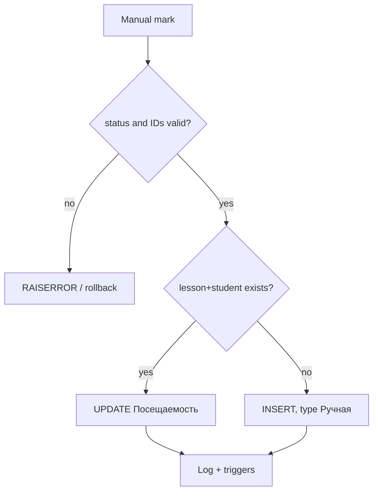

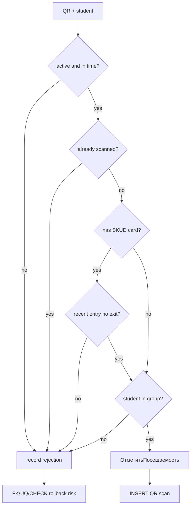

## 12. Документация потоков данных

### DFD Level 0

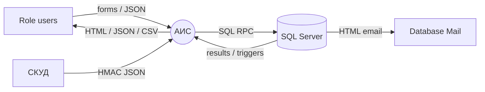

### DFD Level 1 — посещаемость

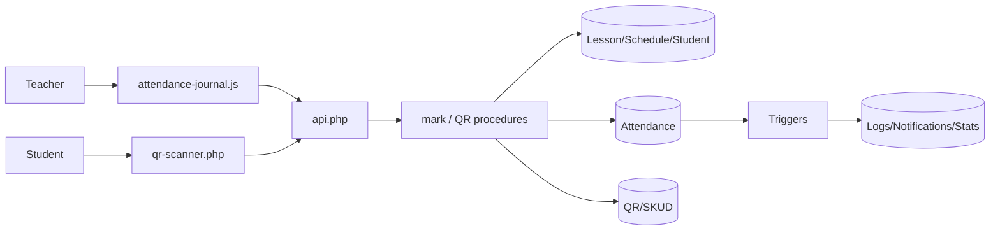

### DFD Level 1 — импорт/экспорт

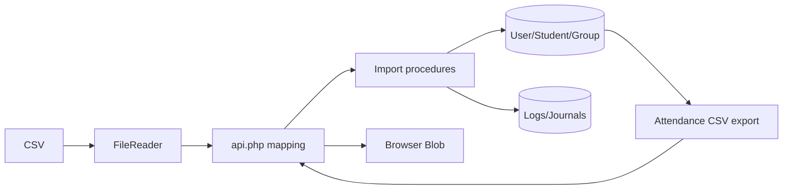

### DFD Level 1 — отчеты

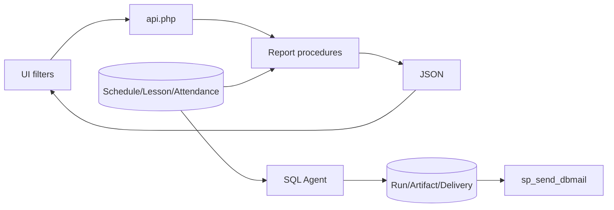

| Поток данных | Источник | Получатель | Формат | Код/файл | Таблицы | Проверка | Ошибки |
|---|---|---|---|---|---|---|---|
| UI RPC | browser | API | JSON/multipart | `common.js`, `api.php` | any via proc | session only | HTTP/business mapping |
| Offline repeat | IndexedDB/localStorage | handler/API | JSON batch | `common.js`, handler | target-dependent | token on replay | repeated queue |
| Attendance | journal/QR | SQL | scalar params | JS + procs | lesson/student/attendance | enum/existence; QR group/SKUD | constraints |
| SKUD | external system | webhook/SQL | signed JSON | `integration/skud/event.php` | SKUD | HMAC/time/nonce/IP | raw exception possible |
| Import | file | SQL | CSV text | page/API/SQL | groups/users/students | partial | per-row errors |
| Export | SQL | browser | semicolon text | export proc | attendance joins | filters | no escaping/size cap |
| Scheduled mail | SQL Agent | Database Mail | HTML | scheduled SQL | report/core | plan/applock | queued ≠ delivered |

## 13. API, маршруты, handlers и формы

Формального REST API нет. `api.php` — RPC endpoint; `action` совпадает с именем procedure.

| Route/Page | Method | File/Handler | Purpose | Input | Output | Required role/session | DB objects | Risks |
|---|---|---|---|---|---|---|---|---|
| `/`, `/index.php` | GET | `index.php` | redirect | PHP session | redirect | valid session | session/user/nav | self-HTTP |
| `/api.php` | GET/POST | `api.php` | generic RPC/import | query/JSON/multipart | JSON | session except 4 public actions | any `dbo` proc | P0 authz/GET mutation |
| `/offline-handler.php` | POST | file | replay batch | token/requests | JSON | target session | target-dependent | secret duplication |
| `/login/` | GET | `login/index.php` | auth/reset UI | forms | HTML/redirect | public | auth/reset | brute force |
| `/login/session_set.php` | POST | file | set PHP session | token/user/role/IDs | JSON | public | none | unvalidated context |
| `/login/logout.php` | GET/POST | file | logout | session/token | redirect/JSON | current | `ЗавершитьСессию` | no CSRF |
| `/notifications.php` | GET | file | notifications | filters | HTML | authenticated | notifications | ID spoofing |
| `/integration/skud/event.php` | POST | file | SKUD webhook | signed JSON | JSON | HMAC/IP | SKUD event proc | local nonce/raw errors |
| `/integration/system/health.php` | request | file | health | secret header | JSON | system secret | health proc | raw errors |
| `/Database/apply_trigger_fix.php` | GET | file | execute SQL fix | none | text | Apache deny only | trigger | unsafe outside Apache |
| `/admin/{backup,control-plane,dashboard,groups,import-export,logs,maintenance,monitoring,offline-queue,profile,reference-data,reports,schedule,scheduled-reports,settings,students,teachers,users}.php` | GET | 18 pages | admin UI | forms | HTML+RPC | Admin/grant | admin/core/report | RPC not role-bound |
| `/methodist/{dashboard,groups,profile,schedule,subjects,teachers}.php` | GET | 6 pages | methodist UI | forms | HTML+RPC | Методист/grant | schedule/reference | IDOR |
| `/teacher/{attendance-journal,dashboard,excuses,profile,qr-generator,reports,schedule}.php` | GET | 7 pages | teacher UI | forms | HTML+RPC | Teacher/grant | attendance/QR/report | no ownership |
| `/curator/{dashboard,excuses,profile,reports,schedule,students}.php` | GET | 6 pages | curator UI | forms | HTML+RPC | Curator/grant | group/report/excuse | actor spoofing |
| `/student/{attendance,dashboard,excuse-form,excuses,notifications,profile,qr-scanner,schedule}.php` | GET | 8 pages | student UI | forms | HTML+RPC | Student/grant | attendance/QR/user | arbitrary IDs |

RPC-категории: auth/reset/session; CRUD пользователей, ролей, справочников и профилей; расписание/занятия; attendance/QR; excuses; notifications/dashboards; logs/settings/maintenance/monitoring/backup/control-plane; reports/import/export/scheduled reports. Исполнимый набор включает 125 уникальных procedures из `Database/*.sql`; gateway также сможет вызвать procedure, созданную вне репозитория в `dbo`.

## 14. Реализация импорта/экспорта

| Direction | Entity | Source/Target | Format | Handler/script | DB tables | Validation | Error handling | Notes |
|---|---|---|---|---|---|---|---|---|
| import | группы | browser → DB | CSV text | `admin/import-export.php`, `api.php`, `ИмпортГруппИзCSV` | group/specialty/logs | mapping headers; SQL parser | counters/errors | base/later signatures conflict; later insert lacks required specialty |
| import | студенты/accounts | browser → DB | semicolon CSV | `Integration SP.sql` | user/student/group/log | required fields, group/login, basic email | per-row transaction/error rows | cursor; quoted semicolon unsupported; failed row may expose password |
| export | attendance | DB → browser Blob | semicolon text | `ЭкспортПосещаемостиВCSV` | attendance joins | dates/group | API error | no quoting/formula protection; `.xls` name is not XLS format |
| export | generic report | DB → browser | nominal CSV | `ЭкспортОтчетаВCSV` | materially none | type only | minimal text | stub; curator passes incompatible params |
| scheduled output | DB → email | HTML | scheduled SQL | scheduled/core tables | plan/recipients | run/delivery rows | not a file export |

`api.php` special-cases two import actions, accepts JSON/multipart, normalizes content and injects validated session user ID/IP. File-size, row-count and memory limits are absent. UI reads the whole file through `FileReader`. `Integration SP.sql` redefines imports with signatures incompatible with the gateway (`КтоСоздал` versus the supplied parameter set), so behavior depends on SQL application order. Group import also uses an invalid/fragile line-splitting approach and cannot reliably satisfy required `Специальность_ID`.

Прямой обмен с 1С через API/COM/OData в исходном коде не обнаружен. Настройки, наименования, CSV-экспорт и индекс `IX_Экспорт_1C_Данные` не доказывают наличие интеграции. Плановый файловый обмен не обнаружен.

## 15. Подсистема формирования отчетов

| Report | File/function | Input filters | Data sources | Aggregation rules | Output format | User role | Risks |
|---|---|---|---|---|---|---|---|
| По группе | `СформироватьОтчетПоГруппе`; fix migration | group/dates | group/student/lesson/attendance | counts/percent | JSON | admin/teacher/curator UI | overwritten proc/date scan |
| По студенту | `СформироватьОтчетПоСтуденту`, detailed proc | student/dates | student/attendance hierarchy | totals/details; multiple sets | JSON | admin/curator | IDOR/client assumptions |
| По преподавателю | corresponding proc | teacher/dates | discipline/schedule/attendance | lesson/attendance aggregates | JSON | admin/teacher | arbitrary teacher ID |
| По дням/неделям/месяцам | corresponding procs | range | lessons/attendance | time buckets | JSON | admin | long-range cost |
| Произвольный | `СформироватьПроизвольныйОтчет` | filters/limit | dynamic core query | parameterized conditions/TOP | JSON | several roles | server limit not capped |
| Attendance CSV | export proc | dates/group | report joins | concatenated rows | text | admin/report UI | escaping/large string |
| Шаблон | template procs | template ID/filters | stored SQL text | no execution | SQL text | admin | explicitly disabled/incomplete |
| Плановые | `scheduled_reports_agent.sql` | calculated period | core/system | generator-specific | HTML mail + DB artifact | SQL Agent | external mail infra/PII |

Скрипт создает три задания Agent: ежедневно в 08:00, по понедельникам в 09:00 и по пятницам в 18:00. Создание условно и требует SQL Agent/прав sysadmin. `sp_send_dbmail` подтверждает постановку в очередь, а не доставку; сверка и финальное обновление доставки не обнаружены.

## 16. Аутентификация и авторизация

Форма входа вызывает публичную `Авторизация`; SQL сравнивает `SHA2_256(пароль + индивидуальная соль)`, журналирует попытку и создает UUID сессии/токен. Браузер вызывает публичный `session_set.php` и сохраняет контекст в PHP session и localStorage. Каждая защищенная страница повторно проверяет DB-сессию. Logout вызывает `ЗавершитьСессию` и уничтожает PHP/client storage.

| Security mechanism | Implementation file | How it works | Confirmed/Not confirmed | Risk | Recommendation |
|---|---|---|---|---|---|
| Password hashing | auth/create/reset procs | SHA-256(password+salt) | подтверждено | fast password hash | Argon2id/bcrypt, rehash |
| Salt | user/procs | random per user | подтверждено | no work factor | keep with KDF |
| Bearer session | session table/check proc | ID+token+active+expiry; sliding +2 h | подтверждено | stolen token reusable | rotate/revoke |
| PHP session | config/session_set | filesystem session, client context | подтверждено | fixation/cookie flags absent | regenerate; Secure/HttpOnly/SameSite |
| Page roles | `requireRole`, control-plane SQL | literal role OR DB path grant | подтверждено | conflicting grant/revoke semantics | one deny-by-default policy |
| Action authorization | `api.php` | session only, then any proc | подтверждено отсутствует | P0 privilege/IDOR | role allowlist and server actor context |
| Admin check | `ПроверитьАдминистратора` | checks passed user ID | подтверждено | spoof seeded admin ID | derive from session |
| Password change | profile/`ОбновитьПарольПользователя` | current password UI value is not sent | подтверждено | arbitrary account takeover | re-auth + target authorization |
| Password policy | settings/reset/profile | reset configurable; profile min 6 | частично | inconsistent | central server policy |
| Brute force/lockout | settings keys only | control not found | не подтверждено | guessing | rate limit/lockout/alert |
| Default users | seed SQL | multiple role users/hashes/sessions | подтверждено | known accounts/hashes/tokens | remove seeds; rotate/invalidate |

Вывод по результатам анализа файлов: аутентификация реализована, но авторизация ограничена страницами и не защищает бизнес-операции. Это нарушение основной trust boundary.

## 17. Обзор информационной безопасности

| Threat | Affected asset | Evidence in code | Existing control | Gap | Severity | Recommendation |
|---|---|---|---|---|---|---|
| Any-procedure call/actor spoof | all data/control | `api.php`, client actor IDs | valid session/prepared RPC | no action RBAC/ownership | P0 critical | allowlist per role; actor from session |
| Change another password | accounts | password proc/profile JS | session | no current password/ownership | P0 critical | re-auth and target rule |
| Repository secrets/sessions | DB/accounts | `config.php`, seed SQL | none | hardcoded DB password, hashes, active tokens | P0 critical | rotate/purge/secrets manager |
| Excess DB privilege | database | `php_user` added to `db_owner` | SQL login | no least privilege | P0 critical | execute-only app role |
| Password cracking | credentials | SHA2-256 procs | random salt | no slow KDF/rate control | P1 high | Argon2id/bcrypt + throttling |
| Session theft/fixation | accounts | `common.js`, `session_set.php` | expiry/revoke | localStorage/no regenerate | P1 high | HttpOnly cookie/token rotation |
| IDOR/role bypass | PII/attendance | generic params/procs | page role | direct API bypass | P0 critical | ownership in server/SQL context |
| CSRF | session/state | no token; cookie endpoints | bearer for most RPC | session_set/logout/SameSite unknown | P1 high | CSRF token/strict methods |
| XSS/token exfiltration | browser | profile innerHTML/no CSP | manual escaping elsewhere | XSS reads localStorage | P1 high | textContent/CSP/HttpOnly |
| SQL injection | DB | prepared binding, parameterized custom report | name regex/proc existence | broad gateway/stored SQL remain | P2 medium | fixed endpoints/dynamic SQL review |
| CSV/formula/file DoS | import/export | UI/API/SQL parser | basic checks | no size/quote/formula controls | P1 high | limits/stream parser/escaping |
| QR failure/replay | attendance | QR procs/constraints | expiry/unique/optional SKUD | bearer QR; rollback branches | P1 high | align enums/outcome transaction |
| SKUD replay | integration | `event.php` | HMAC/time/nonce/IP | local non-distributed nonce | P2 medium | durable shared store/mTLS |
| Sensitive errors | internals | integration catches | API hides unless debug | raw webhook/health detail | P2 medium | opaque error ID/server log |
| Clear transport | credentials/PII | HTTP defaults; DB Encrypt=false | none in repo | TLS absent | P1 high | HTTPS/HSTS/verified SQL TLS |
| Sensitive logs | PII/tokens | action/audit/import details | partial header redaction | inconsistent retention/redaction | P1 high | classification/redaction/retention |
| No real recovery | availability | backup proc only waits/inserts metadata | FULL recovery mode | no BACKUP/restore | P0 critical | encrypted backups/tested restore |
| Maintenance endpoint | schema | `apply_trigger_fix.php` | Apache directory deny | open if rules ignored | P1 high | remove from docroot/CLI only |

Подготовленное связывание параметров снижает риск классической SQL-инъекции через значения, но не ограничивает выбор procedure. TLS termination, firewall, OS ACL, DB login policy, backup vault и сертификаты не обнаружены в репозитории и требуют подтверждения.

## 18. Персональные и чувствительные данные

| Data category | Fields/tables | Where used | Who can access | Exported? | Protection mechanism | Risk |
|---|---|---|---|---|---|---|
| Credentials | login/hash/salt/email/phone, `Пользователь` | auth/admin/profile/reset | UI roles; effectively any session via API | scheduled user report | salted hash | weak hash/IDOR/seed exposure |
| Session secrets | ID/token/IP/UA/expiry | DB/localStorage/IndexedDB/PHP | holder/API/DBA | unintended seeds | expiry/revoke | repo/XSS exposure |
| Student identity | ФИО/DOB/gender/address/phones/group | UI/reports/import | students/admin/curator; API broader | CSV/reports/email | page roles/FK | excessive access/export |
| Teacher identity | ФИО/contacts/department | UI/reports | admin/methodist/teacher; API broader | reports | page roles | IDOR |
| Attendance | date/status/comment/mark type | journals/reports/QR | role UI/API | CSV/HTML email | constraints | behavioral profiling |
| Access/location | card/device/time/direction/GPS | SKUD/QR | DB/procedures | no direct export found | HMAC ingress | movement data/unknown retention |
| Excuse text | reason/status/reviewer | excuse pages | student/teacher/curator | not confirmed | page roles | possible health/family data |
| Report artifacts | detailed/aggregate HTML | scheduled tables/mail | recipients/admin | email | Database Mail | recipient/retention risk |
| Logs | actor/IP/UA/details/errors | admin/temp file | admin/OS/DB | not found | partial redaction | duplicated secrets/PII |

Шифрование at rest/колонок, маскирование, retention/consent и процессы работы с субъектами данных в исходном коде не обнаружены. Требуется инфраструктурное и организационное подтверждение.

## 19. Логирование, аудит и трассируемость

| Event | Logged? | Location | Fields stored | Missing data | Recommendation |
|---|---|---|---|---|---|
| Login success/failure | да | `Лог_Действий` from `Авторизация` | login/user, IP, status, detail | correlation ID/lockout state | add immutable auth audit/correlation |
| Session validation/read requests | нет системно | — | — | caller/action/result | central request audit with redaction |
| User/reference changes | частично | procedure inserts, `Админ_Операции` | actor/action/table/record/detail | reliable before/after; actor trusted from client | server actor + snapshots |
| Attendance mark/change | да, частично | `Лог_Действий`, triggers | actor/action/record/detail | old/new status and reason | versioned attendance audit |
| QR scans | да via QR tables/log | QR/session/student/result/time | outcome-dependent | stable error recording | separate append-only scan ledger |
| SKUD ingress | файл; DB attempt optional | `%TEMP%\ais_integration_audit.log`; SKUD table | headers subset, payload/result | DB proc `ЗаписатьЛогИнтеграции` absent | durable centralized log |
| Import | неодинаково | import journal/base or action log | file/counts/status/errors | row provenance after redefinition | one import-run/row-error model |
| Export | фактически нет надежного журнала | export journal table exists | table definition only | who/what/volume/hash | write journal for every export |
| Scheduled reports | да | run/artifact/delivery tables | plan/period/status/body/recipient | actual mail delivery | reconcile Database Mail IDs |
| PHP/DB errors | частично | JSON response; `Ошибки_Системы` table | SQL error if explicitly written | centralized exception capture | structured protected app log |
| Settings/maintenance | частично | action/admin logs | operation/status | full parameter change | before/after and approval |

`Лог_Действий` — изменяемые операционные данные; защита от подмены не доказана. `TRG_ЛогированиеДействий` после удаления агрегата пересчитывает суточные значения только по текущему batch `inserted`, поэтому статистика ненадежна. Интеграция с SIEM и log shipping не обнаружены.

## 20. Обработка ошибок и надежность

| Scenario | Where handled | Current behavior | User-visible result | Log/audit result | Risk | Recommended improvement |
|---|---|---|---|---|---|---|
| DB connection failure | `config.php`, API catches | throws/JSON error; debug controls detail | generic 500 or detail in debug | app error table not automatic | hidden outage/no correlation | health metric + structured ID/log |
| Invalid login | `Авторизация`, login JS | SQL business error/generic UI | login error | action log | unlimited attempts | throttling/lockout |
| Invalid import file | UI/API/import procs | client check + SQL row errors | counters/table | inconsistent journal | memory DoS/partial data | size/schema/encoding validation before transaction |
| Duplicate records | unique constraints/procs | reject or per-row failure | message/error row | partial | behavior varies by procedure | explicit idempotent policy |
| Missing schedule | lesson/attendance procs | RAISERROR/empty result | message/empty screen | target-dependent | unclear operational state | typed domain error |
| Missing student | CRUD/attendance/import | RAISERROR/row failure | message | partial | IDOR/error distinction | ownership then uniform not-found |
| Report failure | API/SQL/job | JSON failure or failed run | UI error/job status | scheduled run logs | large query can timeout | timeout/resource governance/retry |
| Export failure | API/browser | error or Blob not generated | UI message | export journal unused | no trace/retry | journal/hash/streamed output |
| Permission failure | page guard/API | redirect at page; API only session check | redirect or operation succeeds | no central denied-event log | authorization bypass | centralized authorization/audit |
| QR invalid/duplicate/outside | QR proc | attempts rejected scan insert | likely SQL error due constraints | rejection may roll back | loss of trace and false failure | align enums/nullable outcome FK model |
| Trigger exception | DML transaction | whole parent DML rolls back | generic operation error | trigger monitoring itself may roll back | high coupling | simplify triggers/outbox/retry |

Транзакции применяются во многих write-procedures и для каждой строки импорта, но application unit of work для нескольких API-вызовов отсутствует. Файловый idempotency-кэш хранит ответы 24 часа, индексируется только заданным клиентом ключом, проверяется до аутентификации и не привязан к user/action; известный или повторный ключ может вернуть чужой ответ. Автоочистка незатронутых файлов не обнаружена.

## 21. Анализ производительности и масштабируемости

| Potential bottleneck | Evidence | Impact | Current mitigation | Recommendation | Priority |
|---|---|---|---|---|---|
| Three internal HTTP calls per page | `auth_check.php` | connections/latency/self-deadlock risk | none | direct shared DB/auth service; one context query | P1 |
| Procedure/parameter introspection per RPC | `api.php`, INFORMATION_SCHEMA | metadata queries on every action | none | cached explicit endpoint metadata | P1 |
| Broad report joins/aggregations | report procs | CPU/IO/timeouts as history grows | many report indexes/Query Store | plans, bounded ranges, summary tables | P1 |
| String CSV concatenation | export proc | quadratic memory/2 GB NVARCHAR pressure | none | streaming server export/escaping | P1 |
| Cursor CSV import/per-row transaction | `Integration SP.sql` | low throughput/log churn | row isolation | staging table + set-based validation/one run transaction | P1 |
| Trigger write amplification | 17 triggers, attendance/log triggers | scans, blocking, rollback coupling | monitoring table | move analytics/notifications to async outbox | P1 |
| Repeated/overlapping indexes | 98 index declarations | slower writes/storage/maintenance | maintenance proc | usage/plan analysis then consolidate | P2 |
| Unbounded request/import/report sizes | API/UI/custom report | memory/CPU DoS | few client filters | server caps/pagination/timeouts | P1 |
| File sessions/idempotency | `runtime/*` | local-node affinity/disk growth | TTL on accessed cache entries | shared store + scheduled purge | P2 |
| RCSI disabled | base DB options | reader/writer blocking | indexes | workload test, consider RCSI | P2 |
| CSS duplication | 7 585-line stylesheet/repeated `:root` | transfer/parse/maintenance | browser cache | deduplicate/build minified asset | P3 |
| Pseudo-backup holds transaction/wait | backup proc | needless locks/connection occupancy | 2-second bound | implement real asynchronous backup | P2 |

Query Store и многочисленные covering/filtered indexes настроены. Нагрузочные тесты, baseline cardinality, оценки объемов, стратегия архивации и SLA не обнаружены. Масштабирование более чем на один PHP-узел требует переработки PHP sessions, nonces и idempotency storage.

## 22. Конфигурация и развертывание

| Configuration item | File | Purpose | Default value | Risk | Recommendation |
|---|---|---|---|---|---|
| `AIS_SITE_URL`/`API_URL` | `config.php` | internal URL | `http://localhost/ais-system-ru` | self-HTTP/plaintext/path coupling | eliminate self-call; HTTPS canonical URL |
| DB host/port/name | `config.php` | SQL connection | localhost/15432/`Улучшенная` | environment-specific | mandatory env configuration |
| DB user/password | `config.php` | SQL credentials | `php_user`/hardcoded secret | repository disclosure | rotate and secrets store |
| DB encryption | `config.php` | sqlsrv TLS | Encrypt=false, TrustServerCertificate=true | MITM/clear channel | Encrypt=true + validation |
| `AIS_DEBUG` | `config.php` | error detail | false-like env parsing | accidental disclosure | false in production/central log |
| `AIS_SKUD_SECRET` | config/integration | webhook HMAC | empty | endpoint unusable or weak ops setup | high-entropy managed secret |
| `AIS_SKUD_ALLOWED_IPS` | config | source allowlist | localhost | deployment mismatch | explicit network CIDRs/proxy handling |
| `AIS_HEALTH_SECRET` | config | health auth | absent | endpoint 503 by design | managed secret or internal network/mTLS |
| PHP session path | `config.php` | fallback storage | `runtime/sessions`, mode request 0777 | permissive/local storage | least-privilege ACL/shared secure store |
| `SESSION_LIFETIME_MINUTES` | config | nominal 480 minutes | 480 | not consumed by SQL/PHP policy | one enforced session policy |
| Apache rules | `.htaccess` | deny sensitive paths/rewrite/headers | repo rules | ignored on non-Apache/AllowOverride off | vhost-level rules and deployment test |
| DB files | `Улучшенная.sql` | MDF/LDF | hardcoded MSSQL16 path | install failure/data placement | parameterized DBA script |
| Database Mail profile/base URL | password/scheduled SQL | reset/report mail | profile/key defaults; HTTP `/ais-system` | wrong base path/external dependency | environment-specific verified config |
| SQL Agent jobs | scheduled SQL | scheduling | three fixed schedules | may silently skip without sysadmin/Agent | deployment check/monitoring |

Шаблон окружения, Composer/package manifests, Docker, конфигурация IIS/Nginx, CI/CD, production virtual host, настройка сертификатов, service account/ACL scripts и rollback procedure: «Не обнаружено в репозитории».

## 23. Операционный runbook для инженеров

### Локальный запуск

1. `README.md` requires XAMPP/Apache, PHP with `sqlsrv`, and SQL Server reachable at the configured host/port. Enable Apache reading of `.htaccess`; exact XAMPP/PHP extension installation commands are not in repository and require confirmation.
2. Place the project at the path mapped to `/ais-system-ru`; many browser links are hardcoded to that URL. Set `AIS_SITE_URL` and DB environment variables before Apache starts.
3. Ensure `runtime/sessions`, `runtime/idempotency`, `runtime/tmp` are writable by the PHP identity. Production ACL values require confirmation; do not use 0777.
4. Open `http://localhost/ais-system-ru/` only for local development. Production HTTPS/vhost steps are not in repository.

### Инициализация БД и SQL-скрипты

1. Review and adapt DB/file/login values in `Database/Улучшенная.sql`; it assumes SQL Server 2022 paths and existing login `php_user`.
2. Execute the base script using an approved DBA tool. A canonical `sqlcmd`/SSMS command is not supplied: «Требует подтверждения».
3. Additional scripts are ad hoc migrations. No authoritative order/version table is supplied. The inferred dependency is base → `Дополнения.sql` → schedule/password/control-plane/roles/report fixes/scheduled reports/integration/trigger fix, but this is an inference, not an executable runbook. «Требует подтверждения» before applying.
4. After application, compare actual procedure signatures with `api.php`, run `DBCC CHECKCONSTRAINTS`, verify all 42 tables/125 procedures/17 triggers/3 functions, and inspect failed migration messages. These verification commands are recommendations; an automated repository script is absent.

### Admin user, imports, exports and reports

- Seed admin-like users exist in `Улучшенная.sql`, but no plaintext default password is provided. Verification/secure creation requires DBA confirmation. Seed active sessions must be invalidated.
- Imports are started manually from `/admin/import-export.php`; validate a backup first because there is no full-run rollback.
- Exports/reports are started from `/admin/import-export.php` and role-specific `/reports.php` pages. The generic export is incomplete.
- Scheduled reports require execution of `scheduled_reports_agent.sql`, running SQL Agent and configured Database Mail; verify jobs and mail queue externally.

### Логи и troubleshooting

- UI logs: `/admin/logs.php`, `/admin/monitoring.php`; DB objects: `Лог_Действий`, `Ошибки_Системы`, trigger/statistics tables.
- SKUD transport audit: OS temp file `ais_integration_audit.log`; path is determined by `sys_get_temp_dir()`.
- A 401/redirect: inspect PHP session and call `ПроверитьСессию`; a procedure parameter error: compare the live signature with `api.php` mapping and applied SQL version; empty navigation: inspect control-plane grants and static role route support.
- Real backup/restore steps: «Не обнаружено в репозитории». The admin backup action must not be treated as a recoverable backup.

## 24. Граф зависимостей и вызовов

| Component | Depends on | Used by | Type of dependency | Risk |
|---|---|---|---|---|
| Role page | common includes/JS/API | browser users | source/runtime | mixed UI responsibilities |
| `auth_check.php` | self HTTP API/session/nav procs | all protected pages | synchronous network | triple call/failure coupling |
| `common.js` | browser storage/fetch | all interactive pages | client runtime | local secrets/offline coupling |
| `api.php` | config/sqlsrv/DB metadata/procs | UI/offline | generic RPC | universal privilege surface |
| SQL core procedures | tables/triggers | API/integrations/jobs | DB runtime | migration version coupling |
| Triggers | core/log/notification tables | every parent DML | implicit transaction | hidden side effects |
| SKUD endpoint | config/audit/event proc | external SKUD | HMAC HTTP | local nonce/audit store |
| Scheduled subsystem | Agent/Database Mail/core DB | admin UI/recipients | infrastructure | external readiness unknown |

| Function/Class | Calls | Called by | Purpose |
|---|---|---|---|
| API request handler (`api.php`) | procedure existence/metadata, `ПроверитьСессию`, target RPC | JS, internal calls, offline | dispatch |
| `internalCallAPI` | API URL | `index.php`, `auth_check.php` variants | self-service RPC |
| `requireRole` | role/path grant result | every role page | page authorization |
| `apiRequest`/offline helpers | fetch/offline handler/storage | page scripts | client transport |
| `ПроверитьQRИОтметить` | SKUD/core lookup, `ОтметитьПосещаемость` | student scanner/API | QR attendance |
| `ОтметитьПосещаемость` | attendance/logs/triggers | journal and QR proc | upsert attendance |
| `ВыполнитьПлановыйОтчет` | generators, artifacts, `sp_send_dbmail` | SQL Agent jobs | scheduled orchestration |

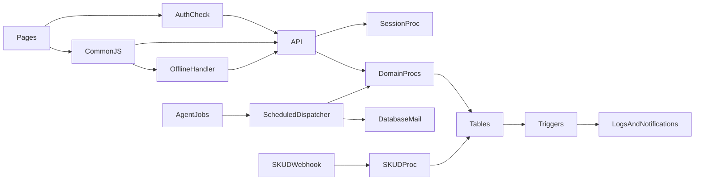

## 25. Обзор качества кода и сопровождаемости

| Issue | Evidence | Impact | Recommendation | Priority |
|---|---|---|---|---|
| Universal procedural gateway | `api.php` | no typed contract/security boundary | explicit controllers/use-cases/DTO allowlist | P0 |
| Mixed page responsibilities | role PHP files with HTML/inline JS/auth | difficult testing/change isolation | templates + controller/service split | P2 |
| Business logic split and overwritten | 150 declarations/125 unique procedure names across SQL | live behavior depends on migration order | versioned immutable migrations/baseline | P0 |
| Duplicated CSS/theme blocks | `assets/css/style.css` (`:root` repeated) | inconsistent UI/large file | tokens/components/build | P3 |
| Duplicated internal API helpers | `index.php`, `auth_check.php` | drift/multiple network calls | one server-side auth context component | P2 |
| Hardcoded URL paths | pages/JS, `/ais-system-ru` | deployment path coupling | one generated base URL/router | P2 |
| Hardcoded secret/defaults | `config.php`, SQL seed | compromise/environment drift | mandatory environment schema/secrets | P0 |
| Weak names/mixed languages and domain IDs | client params/SQL (`Пользователь_ID`, `Студент_ID`) | actor/entity confusion seen in QR log | typed identity/context model | P1 |
| Validation duplicated/inconsistent | UI vs SQL password/import/status checks | bypass and divergent behavior | server validation library/proc conventions | P1 |
| No migration runner/version | `Database/*.sql` | non-repeatable deployment | Flyway/DbUp or signed migration ledger | P1 |
| Implicit trigger side effects | 17 triggers | unpredictable rollback/performance | documented minimal triggers/outbox jobs | P1 |
| Dead/incomplete objects | partition scheme unused; export stub; integration metadata | misleading operability | remove or finish with acceptance tests | P2 |
| No formal dependency manifests | no Composer/package files | irreproducible runtime | versioned runtime/dependency manifest | P2 |

Все 69 PHP-файлов прошли синтаксический разбор, но это подтверждает только корректность грамматики. Конфигурация статического анализа, coding standard, type coverage, lock-файлы зависимостей и генерируемая документация API/схемы отсутствуют.

## 26. Статус тестирования

| Area | Existing tests | Missing tests | Risk | Suggested test cases |
|---|---|---|---|---|
| PHP syntax | one-time analysis: 69/69 pass `php -l` | CI syntax/static analysis | medium | lint on every change |
| Authentication | none found | hash/session/reset/expiry/lockout | critical | bad/good login, fixation, expiry, reset replay |
| Authorization | none found | matrix role×action×object | critical | direct API calls across all roles and IDs |
| Attendance | none found | manual/QR/SKUD/concurrency | critical | group/teacher ownership, duplicate race, enum outcomes |
| Imports | none found | encodings/quotes/large/rollback/signatures | high | malformed headers, semicolon quotes, 100k rows, duplicate |
| Reports/exports | none found | aggregate correctness/performance/escaping | high | reference dataset, date boundaries, CSV injection |
| Triggers | none found | multi-row/constraint/rollback | critical | batch INSERT/UPDATE/DELETE and thresholds |
| Scheduled reports | none found | idempotency/job/mail failure | high | duplicate run, mail queue failure, retry/reconcile |
| Integrations | none found | HMAC/replay/proxy/error leakage | high | invalid time/signature/nonce/multi-node |
| Deployment/recovery | none found | clean install/migration/restore | critical | disposable SQL install and timed restore drill |
| Frontend | none found | XSS/forms/offline/reconnect | high | hostile strings, lost token, replay order |

Test-файлы, PHPUnit, browser test framework, fixtures, mocks, CI-конфигурация и coverage reports: «Не обнаружено в исходном коде».

## 27. Реестр технического долга

| ID | Category | Description | Evidence | Impact | Priority | Proposed fix |
|---|---|---|---|---|---|---|
| TD-001 | security | action/ownership authorization absent | `api.php` | full privilege escalation | P0 | server policy + actor context |
| TD-002 | security | weak password and session storage model | auth SQL/`common.js` | account compromise | P0 | Argon2id/HttpOnly session |
| TD-003 | security | secrets and live-like sessions seeded | config/base SQL | immediate credential exposure | P0 | rotate/purge/scanner |
| TD-004 | database | app DB login is `db_owner` | base SQL | total DB compromise | P0 | least-privilege role |
| TD-005 | deployment | no deterministic migration chain | 10 SQL files/redefinitions | non-reproducible DB | P0 | versioned migrations/baseline |
| TD-006 | database | status constraints conflict with code | QR/lesson/card SQL | transaction failures/data loss | P1 | canonical enums + migration tests |
| TD-007 | integration | import signatures/parsers conflict | API/`Integration SP.sql` | imports fail/partial writes | P1 | staging import contract |
| TD-008 | architecture | self-HTTP and generic RPC | index/auth/API | latency/coupling | P1 | internal service layer/explicit routes |
| TD-009 | performance | heavy triggers/reports/cursors | SQL triggers/reports/import | blocking/timeouts | P1 | set-based/asynchronous processing |
| TD-010 | deployment | backup is metadata simulation | backup proc/UI | unrecoverable loss | P0 | DBA backup/restore automation |
| TD-011 | frontend | tokens/offline payload in web storage | `common.js` | XSS impact | P1 | secure cookie and minimal offline data |
| TD-012 | security | CSRF/CSP/TLS absent in code | endpoints/`.htaccess`/config | web compromise | P1 | platform security baseline |
| TD-013 | documentation | no canonical environment/DB runbook | repository | onboarding/incident delay | P2 | executable deployment docs |
| TD-014 | performance | redundant indexes/no volume baseline | base SQL | write/storage cost | P2 | index usage review/load tests |
| TD-015 | frontend | monolithic duplicated stylesheet/inline scripts | assets/pages | maintenance regressions | P3 | componentized assets |

## 28. Подтвержденные ограничения

### Реализовано

- Role-specific UI, SQL authentication/sessions, educational references, schedules/lessons, manual attendance, QR/СКУД paths, excuses, notifications, interactive reports, CSV file flow, logs/settings and scheduled-report schema/jobs.
- Prepared procedure parameter binding in `api.php`; HMAC/time/nonce/IP checks on the SKUD endpoint.

### Частично реализовано

- Authorization: page access exists, operation/object authorization does not.
- Import/export: UI and procedures exist, but contracts conflict; generic export is a stub and CSV handling is incomplete.
- Audit: many writes are logged, but read/export and before/after traceability are incomplete.
- Notifications: infrastructure exists, while absence threshold trigger logic is incorrect.
- Scheduled reports: generation/queueing exists; actual delivery reconciliation is absent.
- Backup UI/table/procedure exist; no physical backup is executed.

### Не реализовано

- Formal REST API, server controller/service/repository layers, automated tests/CI, deterministic migrations, real backup/restore, direct 1C API client, centralized log pipeline, CSP/CSRF framework, modern password KDF, least-privilege DB access.
- Views and attached table partitioning: «Не обнаружено в исходном коде».

### Требует подтверждения

- Actual production web-server/TLS/firewall/OS ACL and PHP `session.cookie_*` values.
- Exact applied SQL script order and live object definitions.
- SQL Agent/Database Mail/profile readiness and mail delivery monitoring.
- Actual data volumes, SLA, retention, personal-data governance, backup outside repository and restore RTO/RPO.
- Whether seeded accounts/sessions/secrets have ever been deployed or rotated.

## 29. Рекомендации на следующую инженерную итерацию

| Priority | Recommendation | Reason | Affected files/modules | Expected effect |
|---|---|---|---|---|
| P0 | Close generic procedure access with deny-by-default role/action/object policy; derive actor/entity scope from validated session | active total authorization bypass | `api.php`, auth context, all write/read procs | restores trust boundary |
| P0 | Disable arbitrary password target changes; require current password/admin audited flow | account takeover | profile pages/password proc | protects accounts |
| P0 | Rotate DB/SKUD/user/session secrets; remove seed sessions/hashes; introduce secret store | repository compromise | `config.php`, base SQL | invalidates exposed credentials |
| P0 | Replace `db_owner` app login with signed/execute-only role | PHP compromise otherwise owns DB | base SQL/deployment | blast-radius reduction |
| P0 | Implement real automated encrypted backup and tested restore | current action is simulation | backup UI/proc/ops | recoverability |
| P0 | Establish canonical versioned migration baseline and reconcile procedure signatures/constraints | clean install is non-deterministic | all `Database/*.sql`, API mappings | reproducible DB |
| P1 | Move passwords to Argon2id/bcrypt, rate-limit login/reset, rotate session IDs and use Secure HttpOnly SameSite cookies | auth hardening | auth SQL/PHP/JS | reduced credential/session risk |
| P1 | Align QR/lesson/card enums and rewrite QR rejection recording; add concurrency tests | current legitimate branches rollback | QR/trigger SQL | reliable attendance trace |
| P1 | Replace CSV SQL cursor/string builders with bounded staging/streaming parser/export and safe quoting | reliability/security/performance | import page/API/import/export SQL | scalable safe interchange |
| P1 | Remove self-HTTP auth calls and cache one server-side request context | latency/failure coupling | `index.php`, `auth_check.php` | predictable request path |
| P1 | Reduce triggers to integrity only; use transactional outbox/jobs for notifications/statistics | write amplification/hidden rollback | 17 triggers | lower blocking and clearer failures |
| P1 | Enforce HTTPS/HSTS/CSP/CSRF and verified SQL TLS; remove maintenance PHP from docroot | missing transport/browser baseline | `.htaccess`, config, endpoints | web/infrastructure hardening |
| P2 | Add integration/unit/authorization/schema tests and clean-install CI | no regression safety | repository | controlled change |
| P2 | Centralize structured redacted audit with export/import/correlation tracking | incomplete traceability | API/procs/integrations | incident accountability |
| P2 | Profile reports/indexes with production-like volumes and enforce pagination/ranges | likely scale bottlenecks | report SQL/API | bounded resource use |
| P3 | Deduplicate CSS and extract inline JavaScript/components | maintenance cost | `assets/`, pages | smaller coherent frontend |

## 30. Приложение A — Индекс доказательств

| Claim/Conclusion | Evidence file/path | Function/Class/SQL object | Notes |
|---|---|---|---|
| Generic SQL RPC | `api.php` | action validation, INFORMATION_SCHEMA, dynamic procedure call | central architecture/security fact |
| Only four public API actions | `api.php` | public action list | all others need session only |
| DB connection/secrets/TLS defaults | `config.php` | DB_CONFIG/env defaults | hardcoded password not reproduced here |
| Apache protection/routing/headers | `.htaccess` | rewrite/deny/header directives | Apache-dependent |
| Self-HTTP page auth | `index.php`, `includes/auth_check.php` | `internalCallAPI` variants | multiple own-API calls |
| Page role/grant behavior | `includes/auth_check.php`, `role_helpers.php` | `requireRole`, static routes | UI boundary only |
| Client token/offline storage | `assets/js/common.js` | localStorage/IndexedDB/offline functions | full credentials persisted |
| Unvalidated PHP session creation | `login/session_set.php` | request-to-session assignment | no token validation/regeneration |
| Auth hash/session behavior | `Database/Улучшенная.sql` | `Авторизация`, `ПроверитьСессию` | SHA-256/sliding expiry |
| Reset mail/policy | `Database/password_reset_database_mail.sql` | reset procedures/table | DB Mail/external profile |
| 42-table base+extensions | all `Database/*.sql` | `CREATE TABLE` declarations | one duplicate declaration counted once |
| 125 unique procedures/17 triggers/3 functions | all SQL files | declarations | 150 proc declarations due replacement |
| No views | all SQL files | no CREATE VIEW | confirmed by full scan |
| App user db_owner | `Database/Улучшенная.sql` | `sp_addrolemember`/ALTER ROLE area | excessive privilege |
| Seed users and sessions | `Database/Улучшенная.sql` | inserts into user/session | values intentionally omitted from report |
| Manual attendance omissions | `Database/Улучшенная.sql` | `ОтметитьПосещаемость` | no group/teacher check |
| QR constraint defects | base SQL | QR proc/table CHECK/UQ/FK | rejection paths conflict |
| Trigger defects/fix | base SQL, `trigger_notifications_fix.sql`, `apply_trigger_fix.php` | absence trigger | batch count not history |
| Schedule behavior | `schedule_overview_migration.sql` | date functions, overview, lesson trigger | replaces base logic |
| Import contracts | `api.php`, `integration/csv/mapping.php`, `Integration SP.sql`, base SQL | `Импорт*ИзCSV` | signatures/parsers conflict |
| Export limitations | base SQL, report/import UI | export procedures | CSV concatenation/stub |
| Scheduled reports/jobs | `scheduled_reports_agent.sql`, `admin/scheduled-reports.php` | five tables/jobs/dispatcher | delivery queue not reconciliation |
| SKUD controls | `integration/skud/event.php`, `audit.php`, config | HMAC/time/nonce/allowlist | local file state |
| Pseudo-backup | base/`Дополнения.sql`, `admin/backup.php` | `СоздатьРезервнуюКопию` | no `BACKUP DATABASE` |
| No automated tests/manifests/deployment | repository tree | absent test/package/CI/container files | full-tree evidence |
| Frontend duplication/XSS sink | `assets/css/style.css`, `student/profile.php` | repeated `:root`, `innerHTML` message | client risk |

### 30.1 Полный реестр SQL-объектов

Реестр ниже сформирован по всем `Database/*.sql`. Для повторно объявленных объектов перечислены все файлы; действующая версия определяется фактическим порядком применения, который требует подтверждения. Параметры и эффекты ключевых объектов разобраны в разделах 9–17; источником полной сигнатуры остается указанное SQL-объявление. Перечень ограничений содержит 124 уникальных именованных `CONSTRAINT`; nullability и другие inline-атрибуты полей документированы их исходными `CREATE TABLE`.

#### Таблица — 42

| Объект | Целевая таблица | Файл(ы) объявления |
|---|---|---|
| `QR_Сессия` |  | `Улучшенная.sql` |
| `QR_Сканирование` |  | `Улучшенная.sql` |
| `Админ_Операции` |  | `admin_control_plane.sql` |
| `Артефакт_Планового_Отчета` |  | `scheduled_reports_agent.sql` |
| `Аудитория` |  | `Улучшенная.sql` |
| `Восстановление_Пароля` |  | `password_reset_database_mail.sql`, `Улучшенная.sql` |
| `Временные_Данные` |  | `Улучшенная.sql` |
| `Дисциплина` |  | `Улучшенная.sql` |
| `Доставка_Планового_Отчета` |  | `scheduled_reports_agent.sql` |
| `Доступ_Разделов_Ролей` |  | `admin_control_plane.sql` |
| `Журнал_Импорта_CSV` |  | `Улучшенная.sql` |
| `Журнал_Экспорта_CSV` |  | `Улучшенная.sql` |
| `Занятие` |  | `Улучшенная.sql` |
| `Запуск_Планового_Отчета` |  | `scheduled_reports_agent.sql` |
| `Корпус` |  | `Улучшенная.sql` |
| `Лог_Действий` |  | `Улучшенная.sql` |
| `Мониторинг_Триггеров` |  | `Улучшенная.sql` |
| `Настройки_Системы` |  | `Улучшенная.sql` |
| `Обоснования_Отсутствия` |  | `Улучшенная.sql` |
| `Ошибки_Системы` |  | `Улучшенная.sql` |
| `Плановый_Отчет` |  | `scheduled_reports_agent.sql` |
| `Получатель_Планового_Отчета` |  | `scheduled_reports_agent.sql` |
| `Пользователь` |  | `Улучшенная.sql` |
| `Посещаемость` |  | `Улучшенная.sql` |
| `Преподаватель` |  | `Улучшенная.sql` |
| `Разделы_Интерфейса` |  | `admin_control_plane.sql` |
| `Разрешения_Ролей` |  | `Улучшенная.sql` |
| `Расписание` |  | `Улучшенная.sql` |
| `Резервные_Копии` |  | `Улучшенная.sql` |
| `Роль` |  | `Улучшенная.sql` |
| `Сессия_Пользователя` |  | `Улучшенная.sql` |
| `Система_Интеграция` |  | `Улучшенная.sql` |
| `СКУД_Карта` |  | `Улучшенная.sql` |
| `СКУД_Событие` |  | `Улучшенная.sql` |
| `СКУД_Устройство` |  | `Улучшенная.sql` |
| `Специальность` |  | `Улучшенная.sql` |
| `Статистика_Системы` |  | `Улучшенная.sql` |
| `Студент` |  | `Улучшенная.sql` |
| `Уведомления` |  | `Улучшенная.sql` |
| `Учебная_Группа` |  | `Улучшенная.sql` |
| `Факультет` |  | `Улучшенная.sql` |
| `Шаблоны_Отчетов` |  | `Улучшенная.sql` |

#### Хранимая процедура — 125

| Объект | Целевая таблица | Файл(ы) объявления |
|---|---|---|
| `Авторизация` |  | `Улучшенная.sql` |
| `ВосстановитьПароль` |  | `password_reset_database_mail.sql`, `Улучшенная.sql` |
| `ВыполнитьАдминОперацию` |  | `admin_control_plane.sql` |
| `ВыполнитьПлановыйОтчет` |  | `scheduled_reports_agent.sql` |
| `ВыполнитьШаблонОтчета` |  | `Улучшенная.sql` |
| `ДеактивироватьПользователя` |  | `Улучшенная.sql` |
| `ДиагностикаАвторизации` |  | `Улучшенная.sql` |
| `ЕжедневноеОбслуживаниеСистемы` |  | `Улучшенная.sql` |
| `ЗавершитьQRСессию` |  | `Улучшенная.sql` |
| `ЗавершитьВсеСессииПользователя` |  | `Улучшенная.sql` |
| `ЗавершитьСессию` |  | `Улучшенная.sql` |
| `ИзменитьСтатусОбоснования` |  | `Улучшенная.sql` |
| `ИмпортГруппИзCSV` |  | `Integration SP.sql`, `Улучшенная.sql` |
| `ИмпортСтудентовИзCSV` |  | `Integration SP.sql` |
| `ИсправитьНекорректныеСтатусы` |  | `Улучшенная.sql` |
| `ОбновитьДатыВИндексах` |  | `Улучшенная.sql` |
| `ОбновитьЗанятиеСУведомлением` |  | `Улучшенная.sql` |
| `ОбновитьНастройку` |  | `Улучшенная.sql` |
| `ОбновитьПарольПользователя` |  | `Улучшенная.sql` |
| `ОбновитьПользователя` |  | `Улучшенная.sql` |
| `ОбновитьПреподавателя` |  | `admin_control_plane.sql` |
| `ОбновитьРоль` |  | `admin_roles_permissions.sql`, `Улучшенная.sql` |
| `ОбновитьСпециальность` |  | `admin_control_plane.sql` |
| `ОбновитьСтатусЗанятия` |  | `Улучшенная.sql` |
| `ОбновитьСтудента` |  | `Улучшенная.sql` |
| `ОбновитьУчебнуюГруппу` |  | `Улучшенная.sql` |
| `ОбновитьФакультет` |  | `Улучшенная.sql` |
| `ОбслуживаниеИндексов` |  | `Улучшенная.sql` |
| `ОтметитьПосещаемость` |  | `Улучшенная.sql` |
| `ОчиститьДублирующиесяСессии` |  | `Улучшенная.sql` |
| `ОчиститьСтарыеЛоги` |  | `Улучшенная.sql` |
| `ПодтвердитьВосстановлениеПароля` |  | `password_reset_database_mail.sql`, `Улучшенная.sql` |
| `ПоискСтудентов` |  | `admin_control_plane.sql`, `Улучшенная.sql` |
| `ПолучитьАдминОперации` |  | `admin_control_plane.sql` |
| `ПолучитьАктивнуюQRСессию` |  | `Улучшенная.sql` |
| `ПолучитьАудитории` |  | `schedule_overview_migration.sql` |
| `ПолучитьГруппыКуратора` |  | `Улучшенная.sql` |
| `ПолучитьДашбордАдмина` |  | `Дополнения.sql` |
| `ПолучитьДашбордКуратора` |  | `Дополнения.sql` |
| `ПолучитьДашбордМетодиста` |  | `Дополнения.sql` |
| `ПолучитьДашбордПреподавателя` |  | `Улучшенная.sql` |
| `ПолучитьДашбордСтудента` |  | `Дополнения.sql` |
| `ПолучитьДетальныйОтчетПоСтуденту` |  | `Дополнения.sql`, `Улучшенная.sql` |
| `ПолучитьДисциплиныПреподавателя` |  | `schedule_overview_migration.sql`, `Дополнения.sql`, `Улучшенная.sql` |
| `ПолучитьДоставкиПлановогоОтчета` |  | `scheduled_reports_agent.sql` |
| `ПолучитьДоступРазделовРоли` |  | `admin_control_plane.sql` |
| `ПолучитьЗанятияПоДате` |  | `Улучшенная.sql` |
| `ПолучитьЗапускиПлановыхОтчетов` |  | `scheduled_reports_agent.sql` |
| `ПолучитьИнфраструктурныйСтатус` |  | `admin_control_plane.sql` |
| `ПолучитьИсториюQRСканирований` |  | `Улучшенная.sql` |
| `ПолучитьКорпуса` |  | `schedule_overview_migration.sql` |
| `ПолучитьЛогДействий` |  | `Улучшенная.sql` |
| `ПолучитьНавигациюПользователя` |  | `admin_control_plane.sql` |
| `ПолучитьНастройки` |  | `Улучшенная.sql` |
| `ПолучитьОбщуюСтатистику` |  | `Улучшенная.sql` |
| `ПолучитьПлановыеОтчеты` |  | `scheduled_reports_agent.sql` |
| `ПолучитьПолнуюИсторию` |  | `Улучшенная.sql` |
| `ПолучитьПользователяПоID` |  | `Улучшенная.sql` |
| `ПолучитьПосещаемостьПоЗанятию` |  | `Улучшенная.sql` |
| `ПолучитьПреподавателей` |  | `admin_control_plane.sql`, `Улучшенная.sql` |
| `ПолучитьРазделыИнтерфейса` |  | `admin_control_plane.sql` |
| `ПолучитьРазрешенияРоли` |  | `admin_roles_permissions.sql` |
| `ПолучитьРасписаниеОбзор` |  | `schedule_overview_migration.sql` |
| `ПолучитьРасписаниеПоГруппе` |  | `schedule_overview_migration.sql`, `Дополнения.sql`, `Улучшенная.sql` |
| `ПолучитьРасписаниеПоПреподавателю` |  | `schedule_overview_migration.sql`, `Улучшенная.sql` |
| `ПолучитьРоли` |  | `Улучшенная.sql` |
| `ПолучитьСпециальности` |  | `Улучшенная.sql` |
| `ПолучитьСписокБэкапов` |  | `Дополнения.sql` |
| `ПолучитьСписокОбоснований` |  | `Дополнения.sql` |
| `ПолучитьСписокПользователей` |  | `Улучшенная.sql` |
| `ПолучитьСтатистикуГрупп` |  | `Улучшенная.sql` |
| `ПолучитьСтудентаПоID` |  | `Улучшенная.sql` |
| `ПолучитьСтудентовПоГруппе` |  | `Улучшенная.sql` |
| `ПолучитьСтудентовПоКуратору` |  | `Улучшенная.sql` |
| `ПолучитьУведомленияПользователя` |  | `Улучшенная.sql` |
| `ПолучитьУчебныеГруппы` |  | `admin_control_plane.sql`, `Улучшенная.sql` |
| `ПолучитьФакультеты` |  | `Улучшенная.sql` |
| `ПолучитьШаблоныОтчетов` |  | `Улучшенная.sql` |
| `ПометитьУведомленияПрочитанными` |  | `Улучшенная.sql` |
| `ПринятьСобытиеСКУД` |  | `Дополнения.sql`, `Улучшенная.sql` |
| `ПроверитьQRИОтметить` |  | `Улучшенная.sql` |
| `ПроверитьАдминистратора` |  | `admin_control_plane.sql`, `admin_roles_permissions.sql` |
| `ПроверитьДоступКСтранице` |  | `admin_control_plane.sql` |
| `ПроверитьДоступПоРоли` |  | `Улучшенная.sql` |
| `ПроверитьПорогПосещаемости` |  | `Улучшенная.sql` |
| `ПроверитьСессию` |  | `Улучшенная.sql` |
| `ПроверитьСостояниеСистемы` |  | `Улучшенная.sql` |
| `ПроверитьЦелостностьДанных` |  | `Улучшенная.sql` |
| `СгенерироватьQRДляЗанятия` |  | `Улучшенная.sql` |
| `СобратьСтатистикуСистемы` |  | `Улучшенная.sql` |
| `СоздатьДисциплину` |  | `schedule_overview_migration.sql`, `Дополнения.sql`, `Улучшенная.sql` |
| `СоздатьЗанятие` |  | `Улучшенная.sql` |
| `СоздатьОбоснование` |  | `Дополнения.sql` |
| `СоздатьПользователя` |  | `Улучшенная.sql` |
| `СоздатьПреподавателя` |  | `Улучшенная.sql` |
| `СоздатьПреподавателяСУчетнойЗаписью` |  | `admin_control_plane.sql` |
| `СоздатьРасписание` |  | `schedule_overview_migration.sql`, `Дополнения.sql`, `Улучшенная.sql` |
| `СоздатьРезервнуюКопию` |  | `Улучшенная.sql` |
| `СоздатьРоль` |  | `admin_roles_permissions.sql`, `Улучшенная.sql` |
| `СоздатьСпециальность` |  | `Улучшенная.sql` |
| `СоздатьСтудента` |  | `Улучшенная.sql` |
| `СоздатьСтудентаСУчетнойЗаписью` |  | `admin_control_plane.sql` |
| `СоздатьУведомление` |  | `Улучшенная.sql` |
| `СоздатьУчебнуюГруппу` |  | `Дополнения.sql`, `Улучшенная.sql` |
| `СоздатьФакультет` |  | `Улучшенная.sql` |
| `СоздатьШаблонОтчета` |  | `Улучшенная.sql` |
| `СохранитьДоступРазделаРоли` |  | `admin_control_plane.sql` |
| `СохранитьРазделИнтерфейса` |  | `admin_control_plane.sql` |
| `СохранитьРазрешениеРоли` |  | `admin_roles_permissions.sql` |
| `СформироватьОтчетОбслуживания` |  | `scheduled_reports_agent.sql` |
| `СформироватьОтчетПоГруппе` |  | `admin_group_report_fix.sql`, `schedule_overview_migration.sql`, `Улучшенная.sql` |
| `СформироватьОтчетПоДням` |  | `Улучшенная.sql` |
| `СформироватьОтчетПользователейИПропусков` |  | `scheduled_reports_agent.sql` |
| `СформироватьОтчетПоМесяцам` |  | `Улучшенная.sql` |
| `СформироватьОтчетПоНеделям` |  | `Улучшенная.sql` |
| `СформироватьОтчетПоПреподавателю` |  | `Улучшенная.sql` |
| `СформироватьОтчетПосещаемостиСАналитикой` |  | `scheduled_reports_agent.sql` |
| `СформироватьОтчетПоСтуденту` |  | `schedule_overview_migration.sql`, `Улучшенная.sql` |
| `СформироватьПроизвольныйОтчет` |  | `Улучшенная.sql` |
| `УдалитьРазрешениеРоли` |  | `admin_roles_permissions.sql` |
| `УдалитьРоль` |  | `admin_roles_permissions.sql`, `Улучшенная.sql` |
| `УдалитьСпециальность` |  | `Улучшенная.sql` |
| `УдалитьФакультет` |  | `Улучшенная.sql` |
| `ЭкспортОтчетаВCSV` |  | `Улучшенная.sql` |
| `ЭкспортПосещаемостиВCSV` |  | `Улучшенная.sql` |

#### Триггер — 17

| Объект | Целевая таблица | Файл(ы) объявления |
|---|---|---|
| `TRG_АвтоОбновлениеСтатистикиПосещаемости` |  | `Улучшенная.sql` |
| `TRG_АвтосборСтатистики` |  | `Улучшенная.sql` |
| `TRG_АвтоСозданиеЗанятий` |  | `schedule_overview_migration.sql`, `Улучшенная.sql` |
| `TRG_ЗакрытиеQRПоСтатусуЗанятия` |  | `Улучшенная.sql` |
| `TRG_ЗапретДублированияПосещаемости` |  | `Улучшенная.sql` |
| `TRG_ЗапретУдаленияКритическихДанных` |  | `Улучшенная.sql` |
| `TRG_ЗащитаСтруктурыДанных` |  | `Улучшенная.sql` |
| `TRG_КонсистентностьДанныхСтудента` |  | `Улучшенная.sql` |
| `TRG_ЛогированиеДействий` |  | `Улучшенная.sql` |
| `TRG_МониторингСрокаДействияКарт` |  | `Улучшенная.sql` |
| `TRG_МониторингТриггеров` |  | `Улучшенная.sql` |
| `TRG_ОбновлениеПоследнегоВхода` |  | `Улучшенная.sql` |
| `TRG_ОбновлениеСтатусаЗанятия` |  | `Улучшенная.sql` |
| `TRG_СинхронизацияСКУДКарт` |  | `Улучшенная.sql` |
| `TRG_Уведомление_ПриИзмененииРасписания` |  | `Улучшенная.sql` |
| `TRG_УведомленияОПропусках` |  | `Улучшенная.sql` |
| `TRG_УправлениеQRСессиями` |  | `Улучшенная.sql` |

#### Функция — 3

| Объект | Целевая таблица | Файл(ы) объявления |
|---|---|---|
| `AIS_HTML_ENCODE` |  | `scheduled_reports_agent.sql` |
| `AIS_НомерУчебнойНедели` |  | `schedule_overview_migration.sql` |
| `AIS_ТипНеделиДляДаты` |  | `schedule_overview_migration.sql` |

#### Индекс — 98

| Объект | Целевая таблица | Файл(ы) объявления |
|---|---|---|
| `IX_QR_Сессия_Занятие` | `QR_Сессия` | `Улучшенная.sql` |
| `IX_QR_Сессия_Код` | `QR_Сессия` | `Улучшенная.sql` |
| `IX_QR_Сессия_Статус_Время` | `QR_Сессия` | `Улучшенная.sql` |
| `IX_QR_Сканирование_Время` | `QR_Сканирование` | `Улучшенная.sql` |
| `IX_Восстановление_Пароля_Истекает` | `Восстановление_Пароля` | `password_reset_database_mail.sql`, `Улучшенная.sql` |
| `IX_Восстановление_Пароля_Пользователь_Активные` | `Восстановление_Пароля` | `password_reset_database_mail.sql`, `Улучшенная.sql` |
| `IX_Временные_Данные_Истекает` | `Временные_Данные` | `Улучшенная.sql` |
| `IX_Временные_Данные_Ключ` | `Временные_Данные` | `Улучшенная.sql` |
| `IX_Горячие_Данные_Пользователи` | `Пользователь` | `Улучшенная.sql` |
| `IX_Горячие_Данные_Сессии` | `Сессия_Пользователя` | `Улучшенная.sql` |
| `IX_Дисциплина_Код` | `Дисциплина` | `Улучшенная.sql` |
| `IX_Дисциплина_Название_Преподаватель` | `Дисциплина` | `Улучшенная.sql` |
| `IX_Дисциплина_Преподаватель_Статус` | `Дисциплина` | `Улучшенная.sql` |
| `IX_Доставка_Планового_Отчета_Запуск` | `Доставка_Планового_Отчета` | `scheduled_reports_agent.sql` |
| `IX_Доступ_Разделов_Ролей_Роль` | `Доступ_Разделов_Ролей` | `admin_control_plane.sql` |
| `IX_Занятие_ВремяНачалаФакт` | `Занятие` | `Улучшенная.sql` |
| `IX_Занятие_Дата_ДляОтчетов` | `Занятие` | `Улучшенная.sql` |
| `IX_Занятие_Дата_Расписание` | `Занятие` | `Улучшенная.sql` |
| `IX_Занятие_Статус_Дата` | `Занятие` | `Улучшенная.sql` |
| `IX_Занятия_Последние_2_Месяца` | `Занятие` | `Улучшенная.sql` |
| `IX_Запуск_Планового_Отчета_Ключ` | `Запуск_Планового_Отчета` | `scheduled_reports_agent.sql` |
| `IX_Запуск_Планового_Отчета_Код_Период` | `Запуск_Планового_Отчета` | `scheduled_reports_agent.sql` |
| `IX_Комплексный_Отчет_Посещаемости` | `Посещаемость` | `Улучшенная.sql` |
| `IX_Комплексный_Расписание_Преподаватель` | `Расписание` | `Улучшенная.sql` |
| `IX_Комплексный_Система_Интеграция` | `Система_Интеграция` | `Улучшенная.sql` |
| `IX_Конкурентный_Доступ_Занятие` | `Занятие` | `Улучшенная.sql` |
| `IX_Конкурентный_Доступ_Пользователь` | `Пользователь` | `Улучшенная.sql` |
| `IX_Конкурентный_Доступ_Посещаемость` | `Посещаемость` | `Улучшенная.sql` |
| `IX_Лог_Действий_Время` | `Лог_Действий` | `Улучшенная.sql` |
| `IX_Лог_Действий_Пользователь_Время` | `Лог_Действий` | `Улучшенная.sql` |
| `IX_Лог_Действий_Статус_Время` | `Лог_Действий` | `Улучшенная.sql` |
| `IX_Лог_Действий_Таблица_Время` | `Лог_Действий` | `Улучшенная.sql` |
| `IX_Настройки_Системы_Категория_Ключ` | `Настройки_Системы` | `Улучшенная.sql` |
| `IX_Обоснования_Занятие` | `Обоснования_Отсутствия` | `Улучшенная.sql` |
| `IX_Обоснования_Статус` | `Обоснования_Отсутствия` | `Улучшенная.sql` |
| `IX_Обоснования_Студент` | `Обоснования_Отсутствия` | `Улучшенная.sql` |
| `IX_Обоснования_Студент_Дата` | `Обоснования_Отсутствия` | `Улучшенная.sql` |
| `IX_Оптимизация_Время_Реальное` | `Занятие` | `Улучшенная.sql` |
| `IX_Оптимизация_Высокая_Нагрузка` | `Пользователь` | `Улучшенная.sql` |
| `IX_Оптимизация_Занятие_Расписание_Дисциплина` | `Занятие` | `Улучшенная.sql` |
| `IX_Оптимизация_Занятия_Нагрузка` | `Занятие` | `Улучшенная.sql` |
| `IX_Оптимизация_Занятия_Последние3Месяца` | `Занятие` | `Улучшенная.sql` |
| `IX_Оптимизация_Отчетов_Группа` | `Занятие` | `Улучшенная.sql` |
| `IX_Оптимизация_Преподаватель_Отчеты` | `Дисциплина` | `Улучшенная.sql` |
| `IX_Оптимизация_Сессии_Нагрузка` | `Сессия_Пользователя` | `Улучшенная.sql` |
| `IX_ПолучитьЗанятияПоДате` | `Занятие` | `Улучшенная.sql` |
| `IX_Пользователь_Логин` | `Пользователь` | `Улучшенная.sql` |
| `IX_Пользователь_ПоследнийВход` | `Пользователь` | `Улучшенная.sql` |
| `IX_Пользователь_Роль_Активен` | `Пользователь` | `Улучшенная.sql` |
| `IX_Посещаемость_Для_Отчетов_Месячные` | `Посещаемость` | `Улучшенная.sql` |
| `IX_Посещаемость_ДляСвязиСЗанятиями` | `Посещаемость` | `Улучшенная.sql` |
| `IX_Посещаемость_Занятие` | `Посещаемость` | `Улучшенная.sql` |
| `IX_Посещаемость_Занятие_Студент_Cover` | `Посещаемость` | `Улучшенная.sql` |
| `IX_Посещаемость_ИсторическиеДанные` | `Посещаемость` | `Улучшенная.sql` |
| `IX_Посещаемость_Последние_6_Месяцев` | `Посещаемость` | `Улучшенная.sql` |
| `IX_Посещаемость_Статус_Дата` | `Посещаемость` | `Улучшенная.sql` |
| `IX_Посещаемость_Студент_Дата` | `Посещаемость` | `Улучшенная.sql` |
| `IX_Посещаемость_Студент_ДляОтчетов` | `Посещаемость` | `Улучшенная.sql` |
| `IX_Посещаемость_ТипОтметки_Дата` | `Посещаемость` | `Улучшенная.sql` |
| `IX_Преподаватель_Кафедра` | `Преподаватель` | `Улучшенная.sql` |
| `IX_Преподаватель_ФИО` | `Преподаватель` | `Улучшенная.sql` |
| `IX_Разделы_Интерфейса_Путь` | `Разделы_Интерфейса` | `admin_control_plane.sql` |
| `IX_Разделы_Интерфейса_Сортировка` | `Разделы_Интерфейса` | `admin_control_plane.sql` |
| `IX_Расписание_Группа_День` | `Расписание` | `Улучшенная.sql` |
| `IX_Расписание_Дисциплина` | `Расписание` | `Улучшенная.sql` |
| `IX_Роль_УровеньДоступа` | `Роль` | `Улучшенная.sql` |
| `IX_Сессии_Последние_30_Дней` | `Сессия_Пользователя` | `Улучшенная.sql` |
| `IX_Сессия_Пользователя_ВремяИстечения` | `Сессия_Пользователя` | `Улучшенная.sql` |
| `IX_Сессия_Пользователя_Пользователь_Активна` | `Сессия_Пользователя` | `Улучшенная.sql` |
| `IX_Сессия_Пользователя_Токен` | `Сессия_Пользователя` | `Улучшенная.sql` |
| `IX_Система_Интеграция_Тип_Статус` | `Система_Интеграция` | `Улучшенная.sql` |
| `IX_СКУД_Карта_Активна_ДатаИстечения` | `СКУД_Карта` | `Улучшенная.sql` |
| `IX_СКУД_Карта_ДатаИстечения` | `СКУД_Карта` | `Улучшенная.sql` |
| `IX_СКУД_Карта_Номер` | `СКУД_Карта` | `Улучшенная.sql` |
| `IX_СКУД_Карта_Студент_Статус` | `СКУД_Карта` | `Улучшенная.sql` |
| `IX_СКУД_Реальное_Время` | `СКУД_Событие` | `Улучшенная.sql` |
| `IX_СКУД_Событие_Время` | `СКУД_Событие` | `Улучшенная.sql` |
| `IX_СКУД_Событие_Карта` | `СКУД_Событие` | `Улучшенная.sql` |
| `IX_СКУД_Событие_Карта_Время_Тип` | `СКУД_Событие` | `Улучшенная.sql` |
| `IX_СКУД_Событие_Тип_Время` | `СКУД_Событие` | `Улучшенная.sql` |
| `IX_СКУД_Событие_Устройство` | `СКУД_Событие` | `Улучшенная.sql` |
| `IX_СКУД_Устройство_Местоположение_Статус` | `СКУД_Устройство` | `Улучшенная.sql` |
| `IX_Статистика_Системы_Дата_Тип` | `Статистика_Системы` | `Улучшенная.sql` |
| `IX_Статистика_Системы_Тип_Дата` | `Статистика_Системы` | `Улучшенная.sql` |
| `IX_Студент_Группа` | `Студент` | `Улучшенная.sql` |
| `IX_Студент_Группа_ДатаПоступления` | `Студент` | `Улучшенная.sql` |
| `IX_Студент_ФИО` | `Студент` | `Улучшенная.sql` |
| `IX_СформироватьОтчетПоСтуденту` | `Посещаемость` | `Улучшенная.sql` |
| `IX_Уведомления_Пользователь_Прочитано` | `Уведомления` | `Улучшенная.sql` |
| `IX_Уведомления_СрокДействия` | `Уведомления` | `Улучшенная.sql` |
| `IX_Уведомления_Тип_Время` | `Уведомления` | `Улучшенная.sql` |
| `IX_Учебная_Группа_Год_Статус` | `Учебная_Группа` | `Улучшенная.sql` |
| `IX_Учебная_Группа_Название` | `Учебная_Группа` | `Улучшенная.sql` |
| `IX_Учебная_Группа_Специальность` | `Учебная_Группа` | `Улучшенная.sql` |
| `IX_Шаблоны_Отчетов_КтоСоздал` | `Шаблоны_Отчетов` | `Улучшенная.sql` |
| `IX_Шаблоны_Отчетов_Тип_Активен` | `Шаблоны_Отчетов` | `Улучшенная.sql` |
| `IX_Экспорт_1C_Данные` | `Посещаемость` | `Улучшенная.sql` |
| `UX_Восстановление_Пароля_Токен` | `Восстановление_Пароля` | `password_reset_database_mail.sql`, `Улучшенная.sql` |

#### Именованное ограничение — 124

| Объект | Целевая таблица | Файл(ы) объявления |
|---|---|---|
| `CHK_QR_Время_Действия` |  | `Улучшенная.sql` |
| `CHK_Аудитория_Статус` |  | `Улучшенная.sql` |
| `CHK_Аудитория_Тип` |  | `Улучшенная.sql` |
| `CHK_Доставка_Планового_Отчета_Статус` |  | `scheduled_reports_agent.sql` |
| `CHK_Журнал_Импорта_CSV_Статус` |  | `Улучшенная.sql` |
| `CHK_Запуск_Планового_Отчета_Статус` |  | `scheduled_reports_agent.sql` |
| `CHK_Плановый_Отчет_Стратегия` |  | `scheduled_reports_agent.sql` |
| `CHK_Плановый_Отчет_Формат` |  | `scheduled_reports_agent.sql` |
| `CHK_Получатель_Планового_Отчета_Target` |  | `scheduled_reports_agent.sql` |
| `CHK_Расписание_Тип_Недели` |  | `schedule_overview_migration.sql` |
| `CHK_Расписание_ЧислЗнамен` |  | `Дополнения.sql`, `Улучшенная.sql` |
| `CHK_СКУД_Дата_Истечения` |  | `Улучшенная.sql` |
| `DF_Админ_Операции_Активна` |  | `admin_control_plane.sql` |
| `DF_Админ_Операции_ДатаСоздания` |  | `admin_control_plane.sql` |
| `DF_Админ_Операции_Риск` |  | `admin_control_plane.sql` |
| `DF_Админ_Операции_Сортировка` |  | `admin_control_plane.sql` |
| `DF_Админ_Операции_ТребуетПараметры` |  | `admin_control_plane.sql` |
| `DF_Админ_Операции_ТребуетПричину` |  | `admin_control_plane.sql` |
| `DF_Артефакт_Планового_Отчета_Создан` |  | `scheduled_reports_agent.sql` |
| `DF_Восстановление_Пароля_Использован` |  | `password_reset_database_mail.sql`, `Улучшенная.sql` |
| `DF_Восстановление_Пароля_Отправлено` |  | `password_reset_database_mail.sql`, `Улучшенная.sql` |
| `DF_Восстановление_Пароля_Попыток` |  | `password_reset_database_mail.sql`, `Улучшенная.sql` |
| `DF_Восстановление_Пароля_Создано` |  | `password_reset_database_mail.sql`, `Улучшенная.sql` |
| `DF_Доставка_Планового_Отчета_Создан` |  | `scheduled_reports_agent.sql` |
| `DF_Доступ_Разделов_Ролей_ДатаСоздания` |  | `admin_control_plane.sql` |
| `DF_Доступ_Разделов_Ролей_Разрешено` |  | `admin_control_plane.sql` |
| `DF_Запуск_Планового_Отчета_Создан` |  | `scheduled_reports_agent.sql` |
| `DF_Плановый_Отчет_Активен` |  | `scheduled_reports_agent.sql` |
| `DF_Плановый_Отчет_Создан` |  | `scheduled_reports_agent.sql` |
| `DF_Плановый_Отчет_ТолькоДляАдмина` |  | `scheduled_reports_agent.sql` |
| `DF_Плановый_Отчет_Формат` |  | `scheduled_reports_agent.sql` |
| `DF_Плановый_Отчет_Хранить` |  | `scheduled_reports_agent.sql` |
| `DF_Получатель_Планового_Отчета_Активен` |  | `scheduled_reports_agent.sql` |
| `DF_Получатель_Планового_Отчета_Область` |  | `scheduled_reports_agent.sql` |
| `DF_Получатель_Планового_Отчета_Создан` |  | `scheduled_reports_agent.sql` |
| `DF_Разделы_Интерфейса_Активен` |  | `admin_control_plane.sql` |
| `DF_Разделы_Интерфейса_Группа_Сортировка` |  | `admin_control_plane.sql` |
| `DF_Разделы_Интерфейса_ДатаСоздания` |  | `admin_control_plane.sql` |
| `DF_Разделы_Интерфейса_Иконка` |  | `admin_control_plane.sql` |
| `DF_Разделы_Интерфейса_ПоУмолчанию` |  | `admin_control_plane.sql` |
| `DF_Разделы_Интерфейса_Сортировка` |  | `admin_control_plane.sql` |
| `DF_Расписание_Тип_Недели` |  | `schedule_overview_migration.sql` |
| `FK_QR_Сессия_Занятие` |  | `Улучшенная.sql` |
| `FK_QR_Сессия_КтоСоздал` |  | `Улучшенная.sql` |
| `FK_QR_Сканирование_Сессия` |  | `Улучшенная.sql` |
| `FK_QR_Сканирование_Студент` |  | `Улучшенная.sql` |
| `FK_Артефакт_Планового_Отчета_Запуск` |  | `scheduled_reports_agent.sql` |
| `FK_Аудитория_Корпус` |  | `Улучшенная.sql` |
| `FK_Восстановление_Пароля_Пользователь` |  | `password_reset_database_mail.sql`, `Улучшенная.sql` |
| `FK_Группа_Куратор` |  | `Улучшенная.sql` |
| `FK_Дисциплина_Преподаватель` |  | `Улучшенная.sql` |
| `FK_Доставка_Планового_Отчета_Запуск` |  | `scheduled_reports_agent.sql` |
| `FK_Доставка_Планового_Отчета_Получатель` |  | `scheduled_reports_agent.sql` |
| `FK_Доставка_Планового_Отчета_Пользователь` |  | `scheduled_reports_agent.sql` |
| `FK_Доступ_Разделов_Ролей_Раздел` |  | `admin_control_plane.sql` |
| `FK_Доступ_Разделов_Ролей_Роль` |  | `admin_control_plane.sql` |
| `FK_Журнал_Импорта_CSV_Пользователь` |  | `Улучшенная.sql` |
| `FK_Занятие_КтоСоздал` |  | `Улучшенная.sql` |
| `FK_Занятие_Расписание` |  | `Улучшенная.sql` |
| `FK_Запуск_Планового_Отчета_Отчет` |  | `scheduled_reports_agent.sql` |
| `FK_Интеграция_Пользователь` |  | `Улучшенная.sql` |
| `FK_Лог_Пользователь` |  | `Улучшенная.sql` |
| `FK_Настройки_Пользователь` |  | `Улучшенная.sql` |
| `FK_Обоснования_Занятие` |  | `Улучшенная.sql` |
| `FK_Обоснования_КтоРассмотрел` |  | `Улучшенная.sql` |
| `FK_Обоснования_Студент` |  | `Улучшенная.sql` |
| `FK_Ошибки_Пользователь_Возникла` |  | `Улучшенная.sql` |
| `FK_Ошибки_Пользователь_Исправил` |  | `Улучшенная.sql` |
| `FK_Получатель_Планового_Отчета_Группа` |  | `scheduled_reports_agent.sql` |
| `FK_Получатель_Планового_Отчета_Куратор` |  | `scheduled_reports_agent.sql` |
| `FK_Получатель_Планового_Отчета_Отчет` |  | `scheduled_reports_agent.sql` |
| `FK_Получатель_Планового_Отчета_Пользователь` |  | `scheduled_reports_agent.sql` |
| `FK_Получатель_Планового_Отчета_Роль` |  | `scheduled_reports_agent.sql` |
| `FK_Пользователь_Роль` |  | `Улучшенная.sql` |
| `FK_Посещаемость_Занятие` |  | `Улучшенная.sql` |
| `FK_Посещаемость_КтоОтметил` |  | `Улучшенная.sql` |
| `FK_Посещаемость_Студент` |  | `Улучшенная.sql` |
| `FK_Преподаватель_Пользователь` |  | `Улучшенная.sql` |
| `FK_Разрешения_Обновил` |  | `Улучшенная.sql` |
| `FK_Разрешения_Роль` |  | `Улучшенная.sql` |
| `FK_Разрешения_Создал` |  | `Улучшенная.sql` |
| `FK_Расписание_Аудитория` |  | `Улучшенная.sql` |
| `FK_Расписание_Группа` |  | `Улучшенная.sql` |
| `FK_Расписание_Дисциплина` |  | `Улучшенная.sql` |
| `FK_РезервныеКопии_Пользователь` |  | `Улучшенная.sql` |
| `FK_Сессия_Пользователь` |  | `Улучшенная.sql` |
| `FK_СКУД_Карта_КтоВыдал` |  | `Улучшенная.sql` |
| `FK_СКУД_Карта_Студент` |  | `Улучшенная.sql` |
| `FK_СКУД_Событие_Карта` |  | `Улучшенная.sql` |
| `FK_СКУД_Событие_Устройство` |  | `Улучшенная.sql` |
| `FK_СКУД_Устройство_Аудитория` |  | `Улучшенная.sql` |
| `FK_СКУД_Устройство_Ответственный` |  | `Улучшенная.sql` |
| `FK_Специальность_Факультет` |  | `Улучшенная.sql` |
| `FK_Студент_Группа` |  | `Улучшенная.sql` |
| `FK_Студент_Пользователь` |  | `Улучшенная.sql` |
| `FK_Уведомления_Пользователь` |  | `Улучшенная.sql` |
| `FK_Учебная_Группа_Специальность` |  | `Улучшенная.sql` |
| `FK_Шаблоны_Пользователь` |  | `Улучшенная.sql` |
| `FK_Экспорт_Пользователь` |  | `Улучшенная.sql` |
| `PK_Админ_Операции` |  | `admin_control_plane.sql` |
| `PK_Артефакт_Планового_Отчета` |  | `scheduled_reports_agent.sql` |
| `PK_Аудитория` |  | `Улучшенная.sql` |
| `PK_Восстановление_Пароля` |  | `password_reset_database_mail.sql`, `Улучшенная.sql` |
| `PK_Доставка_Планового_Отчета` |  | `scheduled_reports_agent.sql` |
| `PK_Доступ_Разделов_Ролей` |  | `admin_control_plane.sql` |
| `PK_Журнал_Импорта_CSV` |  | `Улучшенная.sql` |
| `PK_Запуск_Планового_Отчета` |  | `scheduled_reports_agent.sql` |
| `PK_Плановый_Отчет` |  | `scheduled_reports_agent.sql` |
| `PK_Получатель_Планового_Отчета` |  | `scheduled_reports_agent.sql` |
| `PK_Разделы_Интерфейса` |  | `admin_control_plane.sql` |
| `PK_Специальность` |  | `Улучшенная.sql` |
| `PK_Факультет` |  | `Улучшенная.sql` |
| `UQ_QR_Сканирование` |  | `Улучшенная.sql` |
| `UQ_Админ_Операции_Код` |  | `admin_control_plane.sql` |
| `UQ_Аудитория_Номер` |  | `Улучшенная.sql` |
| `UQ_Доступ_Разделов_Ролей` |  | `admin_control_plane.sql` |
| `UQ_Занятие` |  | `Улучшенная.sql` |
| `UQ_Плановый_Отчет_Код` |  | `scheduled_reports_agent.sql` |
| `UQ_Посещаемость` |  | `Улучшенная.sql` |
| `UQ_Разделы_Интерфейса_Код` |  | `admin_control_plane.sql` |
| `UQ_Разрешения` |  | `Улучшенная.sql` |
| `UQ_Специальность_Название` |  | `Улучшенная.sql` |
| `UQ_Статистика` |  | `Улучшенная.sql` |
| `UQ_Факультет_Название` |  | `Улучшенная.sql` |

#### Задание SQL Agent — 3

| Объект | Целевая таблица | Файл(ы) объявления |
|---|---|---|
| `AIS_Daily_Maintenance_Report` |  | `scheduled_reports_agent.sql` |
| `AIS_Friday_Users_Gaps_Report` |  | `scheduled_reports_agent.sql` |
| `AIS_Weekly_Attendance_Analytics` |  | `scheduled_reports_agent.sql` |

## 31. Приложение B — Открытые вопросы

| Question | Why it matters | Evidence gap | Who should confirm | Suggested resolution |
|---|---|---|---|---|
| Какой точный порядок и набор SQL-файлов применен? | determines live signatures/security | no version table/runner | DBA/release owner | export `sys.objects` definitions; create baseline |
| Использовались ли seed users/sessions/secrets? | possible active compromise | repo cannot show deployment history | security/DBA | rotate all, invalidate sessions, incident review |
| Где реальные backups and restore evidence? | current UI is not backup | no scripts/artifacts | DBA/operations | documented backup job + restore drill |
| Как настроены HTTPS, SQL TLS, firewall and proxy IP? | transport/source trust | infrastructure absent | operations/security | architecture record and automated checks |
| Какие PHP cookie/session settings active? | fixation/CSRF exposure | php.ini absent | operations | capture effective `phpinfo` securely/config as code |
| Configured ли SQL Agent/Database Mail and profiles? | resets/reports may not work | external server state | DBA | deployment preflight/mail test |
| Каковы volume/SLA/RTO/RPO/retention? | sizing and controls | no NFR | owner/architect/DPO | approve measurable NFR/data policy |
| Кто вправе менять attendance and review excuses? | required authorization matrix | UI hints only | product owner/security | formal role×action×scope matrix/tests |
| Требуется ли real 1C integration? | code only provides file-like hints | no protocol/client | integration owner | define contract or remove misleading settings |
| Как обрабатывается actual email delivery/bounces? | queue status is not delivery | no reconciliation | operations | DB Mail status poller/alert |
| Which import format/encoding is canonical? | current parsers differ | no sample/schema/version | data owner | versioned CSV schema/examples/contract tests |

### Финальный контроль качества

Документ описывает фактическую реализацию и связывает выводы с файлами/SQL-объектами; неподтвержденные инфраструктурные условия помечены. Зафиксированы объекты БД, маршруты, модули, ERD/DFD, алгоритмы, безопасность, интеграции, операции, долги и рекомендации. Длинные code dumps и предположения о несуществующем 1C API исключены. Для передачи системы senior-инженеру остаются внешние подтверждения из раздела 31 и сверка отчета с live schema.
